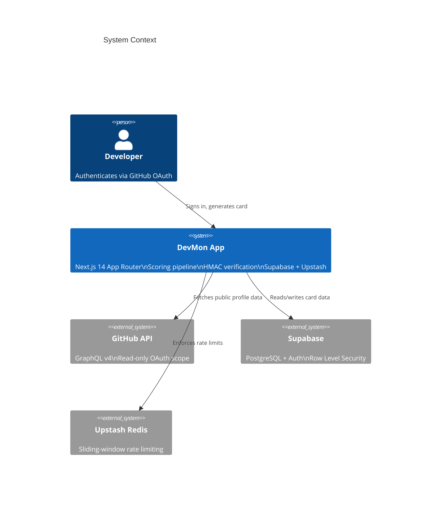
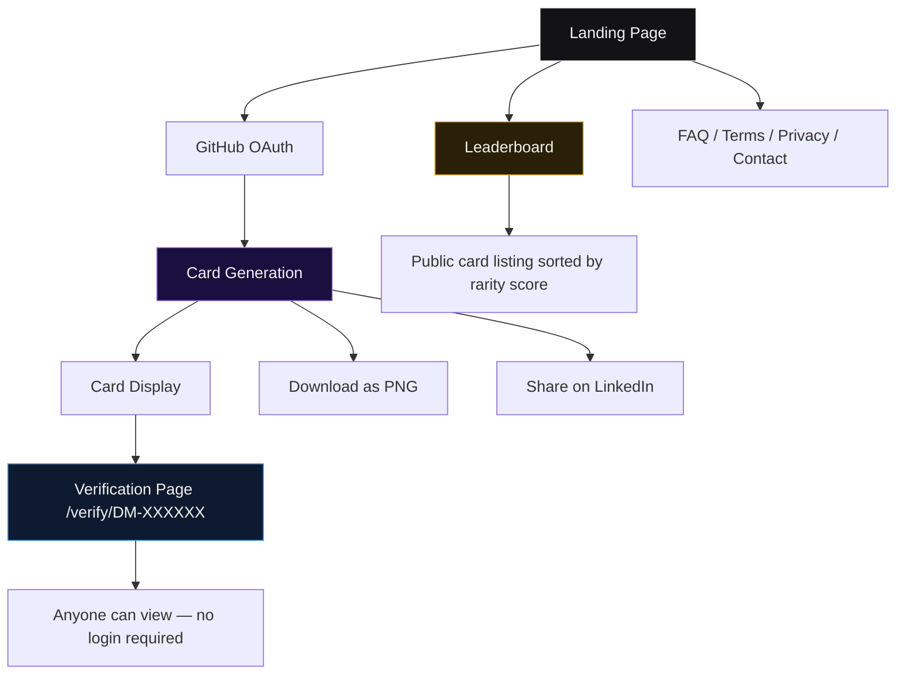
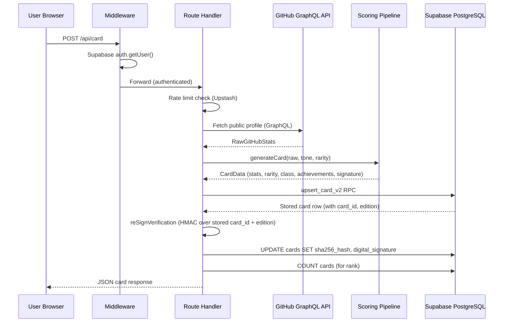
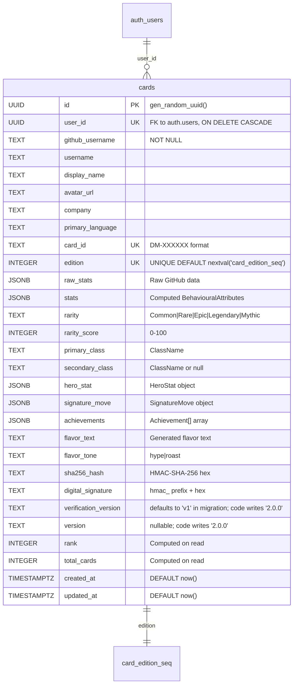
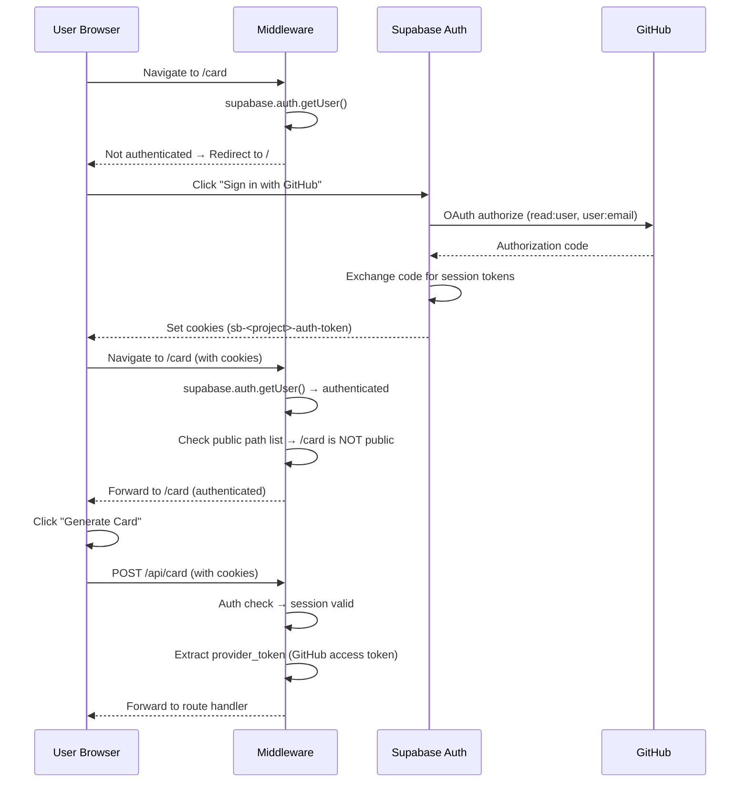
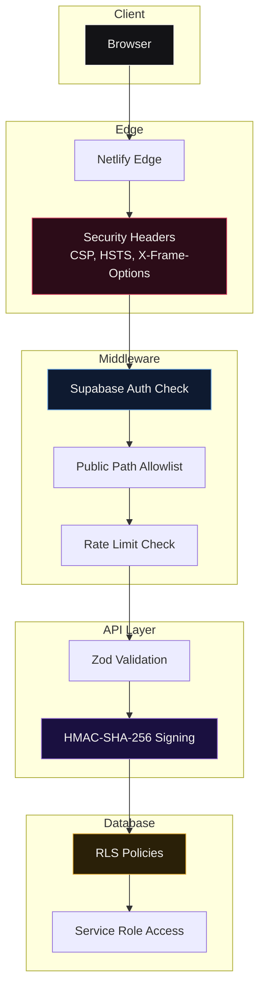

# ARCHITECTURE.md

Complete technical specification for DevMon — a verified developer credential platform powered by public GitHub activity.

---

## 1. System Overview

DevMon is a web application that reads a developer's public GitHub profile via OAuth, computes a set of gameplay-style statistics and a rarity tier, renders a collectible credential card, signs it with an HMAC-SHA-256 cryptographic signature, and serves a public verification page that any third party can inspect without logging in.



**Data flow (card generation):**

1. User authenticates via GitHub OAuth (read-only scope).
2. Server fetches public profile, repositories, contributions, PRs, and issues via the GitHub GraphQL API.
3. The scoring pipeline normalizes raw data into 15 metrics, groups them into 15 intermediate components, aggregates into 5 behavioural attributes, computes a rarity tier, developer classes, signature move, achievements, hero stat, archetype, harmony bonus, and flavor text.
4. A unique card ID (`DM-XXXXXX`) is generated and an HMAC-SHA-256 signature is computed over the username, rarity, and card ID.
5. The full card row is upserted into the `cards` table via the `upsert_card_v2` RPC function.
6. The signed card is returned to the client for rendering, download, and sharing.

---

## 2. Design Philosophy

**"No tracking, no profiling, no bullshit."**

Every architectural decision in DevMon serves this principle:

- **Zero analytics.** No Google Analytics, no Plausible, no Mixpanel, no custom event tracking. No cookies are set by DevMon.
- **Zero fingerprinting.** No browser fingerprinting libraries, no device identification, no session persistence beyond the Supabase auth token.
- **Read-only OAuth.** The GitHub OAuth scope is limited to `read:user` and `user:email`. DevMon never writes to a user's repositories, creates issues, or posts comments on their behalf.
- **Cryptographic verification.** Every card is signed with an HMAC-SHA-256 signature. Verification is performed server-side against the stored hash — not by trusting the client.
- **Public verification without login.** Anyone with a card ID can verify its authenticity at `/verify/DM-XXXXXX` without needing a GitHub account.

---

## 3. Product Architecture



| Feature | Description |
|---------|-------------|
| Card Generation | Fetches GitHub data, normalizes 15 metrics, computes 5 attributes, assigns rarity/class, signs the card, stores it in Supabase |
| Cryptographic Verification | HMAC-SHA-256 signature over username + rarity + card ID; verifiable by any third party |
| Rarity System | Weighted sum of 5 behavioural attributes + harmony bonus, mapped to 5 tiers: Common, Rare, Epic, Legendary, Mythic |
| Leaderboard | Public listing of all cards sorted by rarity score, filterable by company |
| Public Verification Pages | `/verify/DM-XXXXXX` shows the full card and signature without requiring login |

---

## 4. Tech Stack

| Category | Technology | Version | Purpose |
|----------|-----------|---------|---------|
| Framework | Next.js | 14.2+ | App Router, Server Components, Route Handlers |
| Language | TypeScript | 5.4+ | Strict mode, bundler module resolution |
| UI Library | React | 18.3+ | Client and Server Components |
| Styling | Tailwind CSS | 3.4+ | Utility-first CSS, design tokens via CSS custom properties |
| Animation | GSAP | 3.15+ | Hardware-accelerated cursor, landing loader |
| Animation | Motion (Framer Motion) | 12.42+ | Page transitions, accordions, card hover effects |
| Export | html-to-image | 1.11+ | Client-side PNG generation for card download |
| QR Code | qrcode.react | 4.2+ | Verification URL QR codes on cards |
| Validation | Zod | 4.4+ | Runtime schema validation for API inputs |
| Auth | Supabase Auth | via `@supabase/ssr` 0.5+ | GitHub OAuth, session management via cookies |
| Database | Supabase PostgreSQL | via `@supabase/supabase-js` 2.45+ | Card storage, RPC functions, RLS policies |
| Rate Limiting | Upstash Redis | via `@upstash/ratelimit` 2.0+ | Sliding-window rate limiting |
| Testing | Vitest | 4.1+ | Unit tests for scoring algorithms |
| Linting | ESLint | 8.57+ | Code quality enforcement |
| Deployment | Netlify | — | Static hosting, edge functions |

---

## 5. Repository Structure

```
DevMon/
├── src/
│   ├── app/                          # Next.js App Router pages
│   │   ├── layout.tsx                # Root layout, global metadata, theme provider
│   │   ├── page.tsx                  # Landing page
│   │   ├── globals.css               # Design system tokens, Tailwind config
│   │   ├── loading.tsx               # Root loading state
│   │   ├── error.tsx                 # Root error boundary
│   │   ├── not-found.tsx             # 404 page
│   │   ├── providers.tsx             # Theme and context providers
│   │   ├── sitemap.ts                # Dynamic sitemap generation
│   │   ├── robots.ts                 # Robots.txt generation
│   │   ├── card/
│   │   │   ├── layout.tsx            # Card page SEO metadata
│   │   │   ├── page.tsx              # Card generation UI
│   │   │   └── error.tsx             # Card page error boundary
│   │   ├── leaderboard/
│   │   │   ├── layout.tsx            # Leaderboard SEO metadata
│   │   │   ├── page.tsx              # Leaderboard display
│   │   │   └── error.tsx             # Leaderboard error boundary
│   │   ├── verify/
│   │   │   └── [cardId]/
│   │   │       ├── page.tsx          # Public verification page
│   │   │       └── error.tsx         # Verification error boundary
│   │   ├── faq/
│   │   │   ├── layout.tsx            # FAQ SEO metadata
│   │   │   └── page.tsx              # FAQ accordion
│   │   ├── terms/page.tsx            # Terms of Service
│   │   ├── privacy/page.tsx          # Privacy Policy
│   │   ├── contact/page.tsx          # Contact page
│   │   ├── support/page.tsx          # Support / UPI donations
│   │   └── api/
│   │       ├── card/route.ts         # POST: generate card, GET: card count
│   │       ├── leaderboard/route.ts  # GET: paginated leaderboard
│   │       ├── verify/[cardId]/route.ts # GET: verify card by ID
│   │       ├── og/route.tsx          # GET: generate OG image
│   │       ├── health/route.ts       # GET: health check
│   │       ├── debug/route.ts        # GET: debug endpoint
│   │       └── auth/
│   │           ├── callback/route.ts # GET: OAuth callback
│   │           └── signout/route.ts  # POST: sign out
│   ├── components/
│   │   ├── CardFace.tsx              # Desktop card renderer
│   │   ├── CardFaceMobile.tsx        # Mobile card renderer
│   │   ├── DownloadButton.tsx        # PNG export + download
│   │   ├── CustomCursor.tsx          # GSAP-powered cursor
│   │   ├── LinkedInShareModal.tsx    # LinkedIn share flow
│   │   ├── MagneticButton.tsx        # Magnetic hover button
│   │   ├── PageTransition.tsx        # AnimatePresence wrapper
│   │   ├── RarityCrown.tsx           # Rarity crown icon
│   │   ├── ThemeToggle.tsx           # Dark/light theme toggle
│   │   ├── Footer.tsx                # Site footer
│   │   ├── Toast.tsx                 # Toast notifications
│   │   └── legal/
│   │       ├── LegalPageKit.tsx      # Reusable legal page layout
│   │       └── ContactForm.tsx       # Contact form component
│   ├── lib/
│   │   ├── scoring.ts                # Scoring pipeline orchestrator
│   │   ├── normalization.ts          # Metric normalization curves
│   │   ├── attributes.ts             # Component and attribute aggregation
│   │   ├── rarity.ts                 # Weighted attribute rarity
│   │   ├── harmony.ts                # Harmony bonus calculation
│   │   ├── archetypes.ts             # Archetype from attribute pair
│   │   ├── classes.ts                # 12 developer class rules
│   │   ├── signature-move.ts         # 10 signature moves
│   │   ├── achievements.ts           # Achievement tier unlock
│   │   ├── hero-stat.ts              # Hero stat selection
│   │   ├── flavor-text.ts            # 40 flavor text templates
│   │   ├── ranks.ts                  # Attribute rank lookup
│   │   ├── verification.ts           # HMAC-SHA-256 signing
│   │   ├── explainability.ts         # Debug metadata builder
│   │   ├── github.ts                 # GitHub GraphQL fetcher
│   │   ├── validation.ts             # Zod schemas
│   │   ├── rate-limit.ts             # Upstash rate limiter
│   │   ├── auth-helpers.ts           # Session extraction
│   │   ├── motion.ts                 # Framer Motion variants
│   │   ├── theme.tsx                 # Theme context + provider
│   │   ├── upi.ts                    # UPI payment helpers
│   │   ├── supabase/
│   │   │   ├── server.ts             # Server-side Supabase client
│   │   │   └── client.ts             # Browser-side Supabase client
│   │   └── config/
│   │       ├── normalization.ts      # Normalization curve configs
│   │       ├── attributes.ts         # Component and attribute weight configs
│   │       ├── rarity.ts             # Rarity weights and thresholds
│   │       ├── harmony.ts            # Harmony parameters
│   │       ├── engine.ts             # Engine version constants
│   │       ├── classes.ts            # Class definitions
│   │       ├── signatureMoves.ts     # Signature move configs
│   │       ├── achievements.ts       # Achievement tier configs
│   │       ├── archetypes.ts         # Archetype rules
│   │       ├── ranks.ts              # Rank thresholds
│   │       └── index.ts              # Config barrel export
│   ├── types/
│   │   └── index.ts                  # All types, interfaces, constants
│   ├── middleware.ts                 # Auth middleware, public path allowlist
│   └── __tests__/                    # Unit tests
│       └── *.test.ts
├── supabase/
│   └── full_migration.sql            # Authoritative DB schema
├── archive/
│   └── migrations/
│       ├── 001_init.sql              # Historical initial migration
│       ├── 002_upsert_fix.sql        # Historical upsert fix
│       └── 002_reset_and_fix_edition.sql
├── public/
│   ├── favicon.svg                   # Canonical application icon
│   ├── site.webmanifest              # PWA manifest
│   ├── Bronze_Crown.png              # Rarity crown asset
│   ├── Silver_Crown.png              # Rarity crown asset
│   └── Golden_Crown.png              # Rarity crown asset
├── .github/
│   ├── ISSUE_TEMPLATE/
│   │   ├── bug_report.md
│   │   └── feature_request.md
│   └── PULL_REQUEST_TEMPLATE.md
├── next.config.mjs                   # Security headers, CSP, image config
├── tailwind.config.ts                # Tailwind theme
├── tsconfig.json                     # TypeScript config
├── postcss.config.js                 # PostCSS plugins
├── vitest.config.ts                  # Vitest config
├── package.json                      # Dependencies and scripts
├── .env.example                      # Environment variable template
├── .gitignore                        # Git ignore rules
├── README.md                         # Project documentation
├── ARCHITECTURE.md                   # This file
├── DEVELOPER_GUIDE.md                # Setup guide
├── CONTRIBUTING.md                   # Contribution guide
├── DESIGN.md                         # Locked design system
├── SECURITY.md                       # Security policy
├── CHANGELOG.md                      # Release history
├── SUPPORT.md                        # Support information
├── CODE_OF_CONDUCT.md                # Community standards
├── TRADEMARKS.md                     # Trademark policy
└── LICENSE                           # AGPL-3.0 license
```

---

## 6. Frontend Architecture

```mermaid
flowchart TD
    subgraph Pages
        LP[Landing Page<br/>src/app/page.tsx]
        CP[Card Generation<br/>src/app/card/page.tsx]
        LB[Leaderboard<br/>src/app/leaderboard/page.tsx]
        VP[Verification<br/>src/app/verify/[cardId]/page.tsx]
        FP[FAQ<br/>src/app/faq/page.tsx]
    end

    subgraph Shared Components
        CF[CardFace.tsx]
        CFM[CardFaceMobile.tsx]
        DB[DownloadButton.tsx]
        CC[CustomCursor.tsx]
        FT[Footer.tsx]
        MB[MagneticButton.tsx]
        PT[PageTransition.tsx]
        RC[RarityCrown.tsx]
        TT[ThemeToggle.tsx]
        LSM[LinkedInShareModal.tsx]
    end

    CP --> CF
    CP --> CFM
    CP --> DB
    CP --> LSM
    VP --> CF
    VP --> CFM
    LB --> FT
    FP --> FT
    LP --> CC
    LP --> MB
    LP --> FT
    PT -.-> LP
    PT -.-> CP
    PT -.-> LB
    PT -.-> VP
    PT -.-> FP

    style LP fill:#131316,stroke:#F2F1EE,color:#F2F1EE
    style CP fill:#1A1040,stroke:#9B72D8,color:#F2F1EE
    style LB fill:#2A2008,stroke:#E0A830,color:#F2F1EE
    style VP fill:#0E1A30,stroke:#5B9AE0,color:#F2F1EE
    style FP fill:#1A1A1E,stroke:#8B8FA0,color:#F2F1EE
```

### Pages

| Page | Route | Rendering | Description |
|------|-------|-----------|-------------|
| Landing | `/` | Static (SSG) | Marketing page, hero, manifesto, features, quotes, CTA |
| Card Generation | `/card` | Dynamic (SSR) | Auth-generate, displays generated card with download/share |
| Leaderboard | `/leaderboard` | Dynamic (SSR) | Paginated card listing sorted by rarity score |
| Verification | `/verify/[cardId]` | Dynamic (SSR) | Public card verification, no auth required |
| FAQ | `/faq` | Static (SSG) | Accordion-style FAQ with 15 questions |
| Terms | `/terms` | Static (SSG) | Terms of Service |
| Privacy | `/privacy` | Static (SSG) | Privacy Policy |
| Contact | `/contact` | Static (SSG) | Contact form/information |

### Design System (from `globals.css`)

All design tokens are defined as CSS custom properties on `:root` and `[data-theme="dark"]` (716 lines of token definitions):

| Token Category | Examples | Purpose |
|---------------|----------|---------|
| `surface-*` | `surface-primary`, `surface-card`, `surface-elevated` | Background layers |
| `text-*` | `text-primary`, `text-secondary`, `text-tertiary` | Typography hierarchy |
| `accent-*` | `accent-primary`, `accent-glow` | Brand accent colors |
| `rarity-*` | `rarity-common`, `rarity-rare`, `rarity-epic`, `rarity-legendary`, `rarity-mythic` | Rarity tier colors |
| `shadow-*` | `shadow-card`, `shadow-elevated` | Elevation system |
| `glow-*` | `glow-rare`, `glow-epic`, `glow-legendary`, `glow-mythic` | Rarity glow effects |
| `border-*` | `border-hairline`, `border-subtle` | Border colors |

### Animation System

| Library | Usage | Location |
|---------|-------|----------|
| GSAP | Custom cursor magnetic effect, landing page loader animation | `CustomCursor.tsx`, `LandingLoader` |
| Motion (Framer Motion) | Page transitions (`AnimatePresence`), FAQ accordions, card hover effects, modal animations | `PageTransition.tsx`, FAQ `AccordionItem`, `LinkedInShareModal.tsx` |

### Mobile-First Responsive Approach

- Two card renderers: `CardFace.tsx` (desktop) and `CardFaceMobile.tsx` (mobile)
- Responsive breakpoints via Tailwind: `sm:`, `md:`, `lg:`, `xl:`
- Landing page uses stacked layout on mobile, side-by-side on desktop
- Leaderboard switches from card grid to list on small screens

---

## 7. Backend Architecture



### API Routes

| Method | Route | Auth | Rate Limit | Description |
|--------|-------|------|------------|-------------|
| `POST` | `/api/card` | Required | 10 req/min per user | Generate or regenerate a card |
| `GET` | `/api/card` | None | — | Return total card count |
| `GET` | `/api/leaderboard` | None | 60 req/min | Paginated leaderboard (supports `?company=` filter) |
| `GET` | `/api/verify/[cardId]` | None | — | Verify a card by its ID |
| `GET` | `/api/og?user=` | None | 5 req/min | Generate OG image for social sharing |
| `GET` | `/api/health` | None | — | Health check (`{ ok: true }`) |
| `GET` | `/api/auth/callback` | None | — | GitHub OAuth callback, exchanges code for session |
| `POST` | `/api/auth/signout` | None | — | Destroy session, redirect to `/` |

### Middleware (`src/middleware.ts`)

The middleware runs on every request (except static assets) and:

1. Creates a Supabase server client with cookie-based session management.
2. Checks if the user is authenticated via `supabase.auth.getUser()`.
3. Compares the pathname against a public path allowlist:
   - Pages: `/`, `/leaderboard`, `/verify/*`, `/faq`, `/terms`, `/privacy`, `/contact`, `/support`
   - API routes: `/api/auth/*`, `/api/leaderboard/*`, `/api/verify/*`, `/api/og/*`
   - Static: `/_next/*`, `/favicon.svg`, `*.svg`, `*.png`
4. If the user is not authenticated and the path is not public, redirects to `/`.

### Rate Limiting

Rate limiting is implemented via Upstash Redis with a sliding-window algorithm:

| Name | Window | Max Requests | Identifier |
|------|--------|--------------|------------|
| `card-gen` | 60 seconds | 10 | User ID (from Supabase session) |
| `reads` | 60 seconds | 60 | IP address |
| `og` | 60 seconds | 5 | IP address |

When Upstash is not configured (local development), rate limiting is bypassed.

### No-Cache Headers

All `/api/*` routes return:
```
Cache-Control: no-store, no-cache, must-revalidate, proxy-revalidate
Surrogate-Control: no-store
Pragma: no-cache
Expires: 0
```

---

## 8. Database Architecture

### Entity Relationship Diagram



### Indexes

| Index | Columns | Type | Purpose |
|-------|---------|------|---------|
| `idx_cards_card_id` | `card_id` | Unique | Fast lookup by card ID for verification |
| `idx_cards_rarity_score` | `rarity_score DESC` | B-tree | Leaderboard sorting |
| `idx_cards_company` | `company` WHERE `company IS NOT NULL` | Partial | Company-filtered leaderboard |

### Row Level Security (RLS)

| Policy | Operation | Condition | Effect |
|--------|-----------|-----------|--------|
| `public read` | SELECT | `true` | Anyone can read any card row |
| `service role full access` | ALL | `auth.role() = 'service_role'` | Service role can read, write, update, delete |

### `upsert_card_v2` RPC Function

The upsert function uses `SELECT FOR UPDATE` to acquire a row-level lock, preventing race conditions during concurrent card generation:

```sql
-- Pseudocode of the upsert logic:
FUNCTION upsert_card_v2(p_user_id, ...params):
    -- 1. Try to lock existing row
    SELECT * INTO existing_row FROM cards WHERE user_id = p_user_id FOR UPDATE;

    IF FOUND THEN
        -- 2a. UPDATE: preserve existing card_id and edition
        UPDATE cards SET ... WHERE user_id = p_user_id RETURNING *;
    ELSE
        -- 2b. INSERT: allocate new edition from sequence
        real_edition := nextval('card_edition_seq');
        INSERT INTO cards (...) VALUES (...) RETURNING *;
    END IF;
```

**Key behaviors:**
- Existing users keep their original `card_id` and `edition` number across regenerations.
- New users get a fresh `card_id` from `generateCardId()` and a new `edition` from the `card_edition_seq` sequence.
- The `SECURITY DEFINER` qualifier means the function executes with the permissions of the function owner (service role), bypassing RLS.

### Migration Strategy

- **Authoritative source:** `supabase/full_migration.sql` — the single file to run against a clean database.
- **Historical snapshots:** `archive/migrations/` contains the original `001_init.sql`, `002_upsert_fix.sql`, and `002_reset_and_fix_edition.sql` for reference only.
- The `full_migration.sql` drops all legacy tables (`profiles`, `leaderboard`, `editions`, `card_count`) and functions before creating the current schema.

---

## 9. Auth Architecture



### OAuth Flow

1. User clicks "Sign in with GitHub" on the landing page.
2. Supabase Auth redirects to GitHub's OAuth authorize endpoint with scopes `read:user` and `user:email`.
3. GitHub redirects back to `/api/auth/callback` with an authorization code.
4. The callback route exchanges the code for a Supabase session and stores it in HTTP-only cookies.
5. The GitHub access token is stored as `provider_token` in the Supabase session, accessible via `supabase.auth.getSession()`.

### Session Management

- Sessions are managed entirely by Supabase via HTTP-only cookies (`sb-<project-ref>-auth-token`).
- The middleware reads cookies on every request to determine authentication state.
- The `getSessionUser()` helper in `src/lib/auth-helpers.ts` extracts the user ID and GitHub access token from the session.

### Public Path Allowlist

The middleware allows unauthenticated access to:

| Path Pattern | Purpose |
|-------------|---------|
| `/` | Landing page |
| `/leaderboard` | Public leaderboard |
| `/verify/*` | Public card verification |
| `/faq` | FAQ page |
| `/terms` | Terms of Service |
| `/privacy` | Privacy Policy |
| `/contact` | Contact page |
| `/support` | Support page |
| `/api/auth/*` | OAuth callback and signout |
| `/api/leaderboard/*` | Public leaderboard API |
| `/api/verify/*` | Public verification API |
| `/api/og/*` | OG image generation |
| `/_next/*` | Next.js static assets |
| `/favicon.svg`, `*.svg`, `*.png` | Static assets |

---

## 10. Algorithms

### 10.1 Scoring Pipeline (`src/lib/scoring.ts`)

The `generateCard()` function orchestrates the entire pipeline:

```
Input:  RawGitHubStats (fetched from GitHub GraphQL API)
Output: CardData (complete card with all computed fields)

Pipeline:
  1. normalizeAll(raw, config)           → NormalizedMetrics (15 metrics, 0-100)
  2. computeComponents(metrics, config)   → Record<string, number> (15 components, 0-100)
  3. computeAttributes(components, config)→ BehaviouralAttributes (5 attributes, 0-100)
  4. computeArchetype(attributes, config) → Archetype
  5. computeRarityFromAttributes(attributes, harmony, config) → { rarity, rarityScore }
  6. computeHarmony(attributes, config)   → harmony bonus (0-3)
  7. selectHeroStat(attributes, metrics, ranks) → HeroStat
  8. generateSignatureMove(attributes, config) → SignatureMove
  9. generateAchievements(attributes, metrics, config) → Achievement[] (max 6)
  10. assignClasses(attributes, raw, config) → { primaryClass, secondaryClass }
  11. generateFlavorText(raw, attributes, archetype, rarity, tone) → string
  12. generateVerification(username, rarity, cardId, edition) → VerificationData
  13. buildDebugMetadata(...)              → DebugMetadata (if debug mode)
```

**Helper functions:**

```typescript
clamp(value, min, max):
    return Math.min(max, Math.max(min, value))
```

#### Normalization Curves

Each of the 15 metrics uses a normalization curve to map raw values to 0-100:

| Curve | Formula | Usage |
|-------|---------|-------|
| `log` | `ln(1 + raw) / ln(1 + target) × maxScore` | 14 metrics (followers, stars, commits, etc.) |
| `sqrt` | `√raw / √target × maxScore` | 1 metric (organizations) |
| `logistic` | `(1 / (1 + exp(-k × (raw - target)))) - 0.5) × 2 × maxScore` | Available but not used |
| `power` | `(raw / target)^steepness × maxScore` | Available but not used |

**Configuration:** Each metric has `{ curve, target, steepness, maxScore }` in `config/normalization.ts`. The `log` curve uses natural log (ln), not log2. The `steepness` parameter controls curve sensitivity; `target` is the value that maps to ~100. Example:

```typescript
commits:       { curve: "log",  target: 1000, steepness: 1.0, maxScore: 100 }
organizations: { curve: "sqrt", target: 5,    steepness: 1.0, maxScore: 100 }
languages:     { curve: "log",  target: 8,    steepness: 0.8, maxScore: 100 }
accountAge:    { curve: "log",  target: 5,    steepness: 0.6, maxScore: 100 }
```

#### Component Computation

Each of the 15 intermediate components aggregates one or more normalized metrics with configurable weights:

```typescript
component.value = sum(normalizedMetric * metricWeight) for each metric in component.metrics
```

Component definitions (from `config/attributes.ts`):

| Component | Normalized Metrics (weight) |
|-----------|----------------------------|
| `commitOutput` | commits (0.6), recentCommits (0.4) |
| `repositoryBuilding` | originalRepositories (0.7), repositories (0.3) |
| `delivery` | mergedPRs (1.0) |
| `starPower` | stars (1.0) |
| `communityReach` | followers (0.7), forks (0.3) |
| `adoption` | forks (0.5), organizations (0.5) |
| `prCollaboration` | mergedPRs (0.5), contributedTo (0.5) |
| `issueEngagement` | closedIssues (1.0) |
| `organizationalPresence` | organizations (1.0) |
| `streakPower` | currentStreak (0.6), longestStreak (0.4) |
| `activityRegularity` | recentCommits (0.5), commits (0.5) |
| `longevity` | accountAge (1.0) |
| `languageBreadth` | languages (1.0) |
| `projectDiversity` | originalRepositories (0.6), repositories (0.4) |
| `qualitySignal` | stars (0.6), contributedTo (0.4) |

#### Behavioural Attributes

Each of the 5 behavioural attributes aggregates weighted components:

| Attribute | Components (weighted) |
|-----------|----------------------|
| **Execution** | commitOutput (0.35), repositoryBuilding (0.30), delivery (0.35) |
| **Impact** | starPower (0.40), communityReach (0.30), adoption (0.30) |
| **Synergy** | prCollaboration (0.40), issueEngagement (0.35), organizationalPresence (0.25) |
| **Consistency** | streakPower (0.40), activityRegularity (0.35), longevity (0.25) |
| **Mastery** | languageBreadth (0.35), projectDiversity (0.35), qualitySignal (0.30) |

```typescript
attribute.value = sum(componentValue * componentWeight) for each component in attribute.aggregation
```

#### Rarity Score

The rarity score is a weighted sum of the 5 behavioural attributes plus a harmony bonus:

```typescript
rarityWeights = { execution: 0.28, impact: 0.24, synergy: 0.18, consistency: 0.15, mastery: 0.15 }
rarityScore = sum(attribute.value * weight) + harmonyBonus
```

**Thresholds:**

| Tier | Score Range |
|------|-------------|
| Common | 0–45 |
| Rare | 46–70 |
| Epic | 71–88 |
| Legendary | 89–96 |
| Mythic | 97–100 |

---

### 10.2 Rarity System (`src/lib/rarity.ts`)

The rarity score is computed from a weighted sum of the 5 behavioural attributes, plus a harmony bonus:

**Attribute weights:**

| Attribute | Weight |
|-----------|--------|
| Execution | 0.28 |
| Impact | 0.24 |
| Synergy | 0.18 |
| Consistency | 0.15 |
| Mastery | 0.15 |

**Composite formula:**

```
weightedSum = (
    execution * 0.28 +
    impact * 0.24 +
    synergy * 0.18 +
    consistency * 0.15 +
    mastery * 0.15
)
rarityScore = round(min(100, weightedSum + harmonyBonus))
```

**Rarity tier thresholds:**

| Tier | Score Range | Approximate % of Developers |
|------|-------------|---------------------------|
| Common | 0–45 | ~60% |
| Rare | 46–70 | ~25% |
| Epic | 71–88 | ~10% |
| Legendary | 89–96 | ~4% |
| Mythic | 97–100 | ~1% |

**Harmony bonus** (`src/lib/harmony.ts`):

When attributes are balanced (low spread), a bonus of up to +3 is applied:

```
weakest = min(execution, impact, synergy, consistency, mastery)
highest = max(execution, impact, synergy, consistency, mastery)
spread = highest - weakest
weakestFactor = min(1, weakest / 40)
spreadFactor = max(0, 1 - spread / 50)
harmonyBonus = min(3, round(weakestFactor * spreadFactor * 3))
```

**Example:** Developer with attributes Execution=72, Impact=65, Synergy=58, Consistency=60, Mastery=55:
- `weightedSum = 72*0.28 + 65*0.24 + 58*0.18 + 60*0.15 + 55*0.15 = 20.16 + 15.6 + 10.44 + 9.0 + 8.25 = 63.45`
- `weakest = 55`, `highest = 72`, `spread = 17`
- `weakestFactor = min(1, 55/40) = 1`, `spreadFactor = max(0, 1 - 17/50) = 0.66`
- `harmonyBonus = min(3, round(1 * 0.66 * 3)) = min(3, 2) = 2`
- `rarityScore = round(min(100, 63.45 + 2)) = 65` → **Rare** tier

---

### 10.3 Rarity Tier Thresholds (`src/lib/scoring.ts`)

```typescript
getRarityFromScore(score):
    if score >= 97  → "Mythic"
    if score >= 89  → "Legendary"
    if score >= 71  → "Epic"
    if score >= 46  → "Rare"
    else            → "Common"
```

| Tier | Score Range | Approximate % of Developers |
|------|-------------|---------------------------|
| Common | 0–45 | ~60% |
| Rare | 46–70 | ~25% |
| Epic | 71–88 | ~10% |
| Legendary | 89–96 | ~4% |
| Mythic | 97–100 | ~1% |

---

### 10.4 Developer Classes (`src/lib/classes.ts`)

12 classes, each defined by required and preferred attribute thresholds in `config/classes.ts`:

| Class | Archetype | Required Attributes | Preferred Attributes |
|-------|-----------|-------------------|---------------------|
| **PR Titan** | Collaborator | synergy ≥ 40 | execution ≥ 50, synergy ≥ 60 |
| **Bug Hunter** | Maintainer | synergy ≥ 40 | synergy ≥ 60, impact ≥ 40 |
| **Night Owl** | Creator | (none) | (none) — raw metric: >30% commits 00:00–05:00 |
| **Fork Warden** | Explorer | impact ≥ 30 | impact ≥ 50, synergy ≥ 40 |
| **Commit Phantom** | Creator | (none) | (none) — raw metric: repo pushed >1yr after creation |
| **Open Source Sentinel** | Collaborator | synergy ≥ 30 | synergy ≥ 50, impact ≥ 40 |
| **Merge Griffin** | Builder | execution ≥ 40 | execution ≥ 60, consistency ≥ 50 |
| **Stack Guardian** | Architect | mastery ≥ 30 | mastery ≥ 50, execution ≥ 40 |
| **Polyglot Artisan** | Explorer | mastery ≥ 40 | mastery ≥ 60, execution ≥ 40 |
| **Code Archivist** | Maintainer | mastery ≥ 30, consistency ≥ 30 | mastery ≥ 50, consistency ≥ 50 |
| **Green Sprout** | Builder | (none) | execution ≥ 30, consistency ≥ 30 — raw metric: account age < 2 years |
| **Zen Coder** | Maintainer | consistency ≥ 40 | consistency ≥ 60, mastery ≥ 50 |

**Classification logic:**

1. For each class definition, check if all `required` attribute thresholds are met. If not, score = 0.
2. If a `rawMetricOverride` is defined and returns 0, score = 0. If it returns a value, that's the score.
3. Otherwise, score = sum of `min(1, attribute / preferredValue) * preferredWeight` for each preferred attribute.
4. Highest-scoring class becomes `primary`. Second-highest becomes `secondary` (if score > 0).
5. If no class scores above 0, default to `Stack Guardian`.

---

### 10.5 Signature Moves (`src/lib/signature-move.ts`)

10 moves defined in `config/signatureMoves.ts`, each associated with a primary+secondary attribute pair:

| Move | Primary Attribute | Secondary Attribute | Icon |
|------|------------------|--------------------|----|
| Release Avalanche | execution | impact | A |
| Infinite Merge | execution | consistency | I |
| Merge Tempest | execution | synergy | T |
| Precision Architect | execution | mastery | P |
| Community Catalyst | impact | synergy | C |
| Framework Forge | impact | mastery | F |
| Evergreen Legacy | impact | consistency | E |
| Open Source Nexus | synergy | mastery | N |
| Alliance Protocol | synergy | consistency | L |
| Eternal Craftsman | mastery | consistency | K |

**Selection logic:**

1. Sort the 5 behavioural attributes by score descending.
2. Take the top and second attribute.
3. Look up a move matching that primary+secondary pair.
4. If both attributes meet the minimum threshold (25) and a match exists, use that move.
5. Otherwise, default to "Novice Punch" (`DEFAULT_SIGNATURE_MOVE`).

---

### 10.6 Achievements (`src/lib/achievements.ts`)

20 achievement tier configs (4 tiers × 5 attributes) defined in `config/achievements.ts`, plus 3 special achievements:

**Per-attribute tiers:** For each of the 5 attributes (execution, impact, synergy, consistency, mastery), there are 4 tiers (bronze/silver/gold/platinum) with ascending thresholds. The highest unlocked tier for each attribute is included.

**Special achievements:**
- **Grandmaster (Mastery):** Unlocked when mastery ≥ 95
- **Grandmaster (Execution):** Unlocked when execution ≥ 95
- **Balanced Elite:** Unlocked when all 5 attributes ≥ 70

Achievements are sorted (special first) and capped at 6 total.

---

### 10.7 Hero Stat (`src/lib/hero-stat.ts`)

Selects the single most impressive attribute to display prominently on the card:

1. Sort the 5 behavioural attributes by score descending.
2. The highest attribute becomes the hero stat.
3. Include the attribute label and rank (Novice/Adept/Veteran/Expert/Master/Grandmaster).

**Ranks** (`config/ranks.ts`):

| Rank | Score Range |
|------|-------------|
| Novice | 0–19 |
| Adept | 20–39 |
| Veteran | 40–59 |
| Expert | 60–79 |
| Master | 80–94 |
| Grandmaster | 95–100 |

---

### 10.8 Flavor Text (`src/lib/flavor-text.ts`)

40 templates split between two tones:

- **Hype (celebratory):** 30 templates — positive, celebratory language
- **Roast (brutally honest):** 10 templates — self-deprecating, humorous

**Template interpolation variables:**

| Variable | Source |
|----------|--------|
| `{{stars}}` | `raw.totalStars` |
| `{{repos}}` | `raw.totalRepos` |
| `{{starsPerRepo}}` | `raw.totalStars / raw.totalRepos` |
| `{{zeroStars}}` | `raw.zeroStarRepos` |
| `{{allCaps}}` | `raw.allCapsRepos.slice(0, 3)` |
| `{{totalCommits}}` | `raw.totalCommits` |
| `{{recentCommits}}` | `raw.recentCommits` |
| `{{langCount}}` | `raw.languages.length` |
| `{{topLang}}` | `raw.languages[0].name` |
| `{{currentStreak}}` | `raw.currentStreak` |
| `{{longestStreak}}` | `raw.longestStreak` |
| `{{prsMerged}}` | `raw.mergedPRs` |
| `{{closedIssues}}` | `raw.closedIssues` |
| `{{orgCount}}` | `raw.orgCount` |
| `{{contributedTo}}` | `raw.contributedTo` |
| `{{year}}` | `new Date().getFullYear()` |
| `{{accountYear}}` | `new Date(raw.createdAt).getFullYear()` |
| `{{rarity}}` | Assigned rarity tier |
| `{{className}}` | Assigned class name |
| `{{attributes.execution}}` | Computed execution attribute |
| `{{attributes.impact}}` | Computed impact attribute |
| `{{attributes.synergy}}` | Computed synergy attribute |
| `{{attributes.consistency}}` | Computed consistency attribute |
| `{{attributes.mastery}}` | Computed mastery attribute |
| `{{forkedRepos}}` | `raw.forkedRepos` |
| `{{originalRepos}}` | `raw.originalRepos` |

**Selection:** Random template from the chosen tone's pool, interpolated with the developer's stats and attributes.

---

### 10.9 Card ID Generation (`src/lib/verification.ts`)

```
Format: DM-XXXXXX
Charset: ABCDEFGHJKLMNPQRSTUVWXYZ23456789 (32 chars, no ambiguous I/1/0/O)
Length: 6 alphanumeric characters after "DM-" prefix
Entropy: 32^6 = 1,073,741,824 possible IDs
Generation: crypto.randomBytes(6) → each byte mod 32 → index into charset
```

**HMAC-SHA-256 signature:**

```
payload = JSON.stringify({ username, rarity, cardId })
signature = HMAC-SHA-256(payload, HMAC_SECRET)
digital_signature = "hmac_" + signature_hex
```

Note: The payload includes `username`, `rarity`, and `cardId` — not the stats object. This ensures the signature remains valid even if scoring weights are rebalanced.

---

## 11. Mathematical Formulas

### Logarithmic Scaling

Used across normalization to compress wide value ranges:

```
logScore(raw, target, steepness, maxScore) = ln(1 + raw) / ln(1 + target) × maxScore
```

### Square Root Scaling

```
sqrtScore(raw, target, steepness, maxScore) = √raw / √target × maxScore
```

### Clamping

All normalized metrics and components are clamped to 0-100:

```
clamp(value, min, max) = Math.min(max, Math.max(min, value))
```

### Card ID Entropy

```
Total possible card IDs = 32^6 = 1,073,741,824 (~1 billion)
Collision probability at 10,000 cards: ≈ 0.0046%
```

---

## 12. Security Architecture



### Security Headers (from `next.config.mjs`)

| Header | Value | Purpose |
|--------|-------|---------|
| `X-Content-Type-Options` | `nosniff` | Prevents MIME-type sniffing |
| `X-Frame-Options` | `DENY` | Prevents clickjacking |
| `X-XSS-Protection` | `1; mode=block` | XSS filter in legacy browsers |
| `Referrer-Policy` | `strict-origin-when-cross-origin` | Limits referrer information |
| `Permissions-Policy` | `camera=(), microphone=(), geolocation=()` | Disables browser features |
| `Strict-Transport-Security` | `max-age=63072000; includeSubDomains; preload` | Forces HTTPS for 2 years |
| `Content-Security-Policy` | See below | Restricts resource loading |

### Content Security Policy

```
default-src 'self'
script-src 'self' 'unsafe-eval' 'unsafe-inline'
style-src 'self' 'unsafe-inline' https://fonts.googleapis.com
font-src 'self' https://fonts.gstatic.com
img-src 'self' data: blob: https://avatars.githubusercontent.com https://*.githubusercontent.com
connect-src 'self' https://*.supabase.co https://api.github.com https://avatars.githubusercontent.com https://*.githubusercontent.com
frame-ancestors 'none'
```

### Cryptographic Verification

- **Algorithm:** HMAC-SHA-256
- **Secret:** `HMAC_SECRET` environment variable
- **Payload:** `JSON.stringify({ username, rarity, cardId })`
- **Storage:** `sha256_hash` (hex) and `digital_signature` (`hmac_` prefix + hex)
- **Verification:** Any third party can re-compute the HMAC using the public card data and the known secret to verify authenticity

### Environment Variables

| Variable | Client | Purpose |
|----------|--------|---------|
| `NEXT_PUBLIC_SUPABASE_URL` | Yes | Supabase project URL |
| `NEXT_PUBLIC_SUPABASE_ANON_KEY` | Yes | Supabase anonymous key |
| `SUPABASE_SERVICE_ROLE_KEY` | No | Supabase service role (bypasses RLS) |
| `GITHUB_TOKEN` | No | GitHub personal access token for API calls |
| `UPSTASH_REDIS_REST_URL` | No | Upstash Redis endpoint |
| `UPSTASH_REDIS_REST_TOKEN` | No | Upstash Redis auth token |
| `HMAC_SECRET` | No | HMAC signing secret |
| `NEXT_PUBLIC_SITE_URL` | Yes | Site URL for OG images and redirects |

---

## 13. API Reference

### `POST /api/card`

Generate or regenerate a developer card.

**Auth:** Required (Supabase session with GitHub provider token)
**Rate Limit:** 10 requests per minute per user

**Request body (optional):**
```json
{
  "tone": "hype" | "roast",
  "rarity": "Common" | "Rare" | "Epic" | "Legendary" | "Mythic"
}
```

**Response (200):**
```json
{
  "card": {
    "username": "octocat",
    "displayName": "The Octocat",
    "avatarUrl": "https://avatars.githubusercontent.com/u/1?v=4",
    "attributes": { "execution": 72, "impact": 65, "synergy": 58, "consistency": 60, "mastery": 55 },
    "rarity": "Epic",
    "rarityScore": 75,
    "primaryClass": "Open Source Sentinel",
    "secondaryClass": "Merge Griffin",
    "flavorText": "A true Open Source Sentinel...",
    "signatureMove": { "name": "Community Pulse", "description": "120 developers watching the journey", "icon": "♥" },
    "achievements": [{ "label": "Stars", "value": "1.2K", "icon": "★" }],
    "verification": {
      "cardId": "DM-A3B7K9",
      "edition": 1,
      "generatedAt": "2026-07-15T12:00:00.000Z",
      "version": "2.0.0",
      "sha256Hash": "a1b2c3...",
      "digitalSignature": "hmac_a1b2c3..."
    },
    "heroStat": { "attribute": "mastery", "label": "Languages", "score": 85, "rank": "Expert" },
    "archetype": "Builder",
    "className": "Open Source Sentinel",
    "generatedAt": "2026-07-15T12:00:00.000Z",
    "rank": 3,
    "totalCards": 150
  }
}
```

**Error responses:**
- `401` — Unauthorized (no session)
- `429` — Rate limit exceeded
- `500` — Card generation failed

---

### `GET /api/leaderboard`

Retrieve the public leaderboard.

**Auth:** None
**Rate Limit:** 60 requests per minute

**Query parameters:**
| Parameter | Type | Default | Description |
|-----------|------|---------|-------------|
| `company` | string | — | Filter by company name |
| `limit` | number | 20 | Results per page (max 100) |
| `offset` | number | 0 | Pagination offset |

**Response (200):**
```json
{
  "entries": [
    {
      "username": "octocat",
      "displayName": "The Octocat",
      "avatarUrl": "...",
      "rarity": "Legendary",
      "rarityScore": 92,
      "primaryClass": "PR Titan",
      "attributes": { "execution": 85, "impact": 78, "synergy": 90, "consistency": 72, "mastery": 68 },
      "company": "GitHub",
      "primaryLanguage": "TypeScript",
      "generatedAt": "2026-07-15T12:00:00.000Z"
    }
  ],
  "total": 20
}
```

---

### `GET /api/verify/[cardId]`

Verify a card by its unique ID.

**Auth:** None

**Path parameters:**
| Parameter | Format | Example |
|-----------|--------|---------|
| `cardId` | `DM-[A-Z0-9]{6}` | `DM-A3B7K9` |

**Response (200):**
```json
{
  "verified": true,
  "card": {
    "username": "octocat",
    "displayName": "The Octocat",
    "avatarUrl": "...",
    "rarity": "Epic",
    "rarityScore": 75,
    "primaryClass": "Open Source Sentinel",
    "attributes": { ... },
    "verification": {
      "cardId": "DM-A3B7K9",
      "edition": 1,
      "generatedAt": "2026-07-15T12:00:00.000Z",
      "version": "2.0.0",
      "digitalSignature": "hmac_a1b2c3...",
      "sha256Hash": "a1b2c3..."
    }
  }
}
```

**Error responses:**
- `400` — Invalid card ID format
- `404` — Card not found
- `500` — Database error

---

### `GET /api/og?user=`

Generate an Open Graph image for social sharing.

**Query parameters:**
| Parameter | Required | Description |
|-----------|----------|-------------|
| `user` or `username` | Yes | GitHub username |

**Response:** PNG image (800x500) with `Cache-Control: public, max-age=86400`

---

### `GET /api/health`

Health check endpoint.

**Response (200):** `{ "ok": true }`

---

## 14. Performance Considerations

### Rendering Strategy

| Page | Strategy | Reason |
|------|----------|--------|
| Landing (`/`) | Static (SSG) | No dynamic data, marketing content only |
| FAQ (`/faq`) | Static (SSG) | Static content, no user data |
| Terms, Privacy, Contact | Static (SSG) | Static legal content |
| Card (`/card`) | Dynamic (SSR) | Requires auth, fetches fresh GitHub data |
| Leaderboard (`/leaderboard`) | Dynamic (SSR) | Reads from database, changes on each card generation |
| Verification (`/verify/[cardId]`) | Dynamic (SSR) | Reads from database by card ID |

### Caching Strategy

- **API routes:** No-cache (`no-store, no-cache, must-revalidate`) — fresh data on every request.
- **OG images:** 24-hour cache (`max-age=86400, s-maxage=86400, stale-while-revalidate=604800`).
- **Static pages:** Next.js ISR with revalidation.

### Client-Side Performance

- **PNG export:** `html-to-image` renders the card DOM node to a canvas on the client, avoiding server-side screenshot infrastructure.
- **GSAP animations:** Hardware-accelerated via `transform` and `opacity` properties.
- **Image optimization:** Next.js `<Image>` component for GitHub avatars with automatic format negotiation.
- **Code splitting:** Next.js App Router automatically splits code by route.

---

## 15. Deployment

### Netlify Configuration

| Setting | Value |
|---------|-------|
| Build command | `next build` |
| Publish directory | `.next` |
| Node.js version | 18+ |
| Site URL | `https://dev-mon.netlify.app/` |

### Environment Variables Checklist

| Variable | Required | Notes |
|----------|----------|-------|
| `NEXT_PUBLIC_SUPABASE_URL` | Yes | From Supabase dashboard |
| `NEXT_PUBLIC_SUPABASE_ANON_KEY` | Yes | From Supabase dashboard |
| `SUPABASE_SERVICE_ROLE_KEY` | Yes | From Supabase dashboard, keep secret |
| `GITHUB_TOKEN` | Yes | Personal access token for GitHub API |
| `UPSTASH_REDIS_REST_URL` | Yes | From Upstash dashboard |
| `UPSTASH_REDIS_REST_TOKEN` | Yes | From Upstash dashboard |
| `HMAC_SECRET` | Yes | Random string for HMAC signing |
| `NEXT_PUBLIC_SITE_URL` | Yes | `https://dev-mon.netlify.app/` |

### Build & Deploy

```bash
# Local development
npm run dev

# Production build
npm run build

# Run tests
npm run test

# Lint
npm run lint
```

---

## 16. Monitoring and Observability

### Health Check

- `GET /api/health` returns `{ "ok": true }` — suitable for uptime monitoring services (e.g., UptimeRobot, BetterStack).

### Logging

- Card generation logs structured JSON to stdout:
  ```json
  {
    "method": "POST",
    "route": "/api/card",
    "userId": "uuid",
    "cardId": "DM-XXXXXX",
    "duration": 2340
  }
  ```
- Errors logged via `console.error` with context (e.g., `upsert_card error:`, `verify query error:`).

### External Dashboards

- **Supabase Dashboard:** Database metrics, auth logs, API usage.
- **Upstash Dashboard:** Rate limiting metrics, request counts, latency.

### Zero-Tracking Philosophy

No external error tracking (Sentry, Bugsnag), no analytics (Google Analytics, Plausible), no A/B testing tools. Consistent with the design philosophy.

---

## 17. Scalability Considerations

### Horizontal Scaling

- **Netlify Edge:** Static pages served from CDN edge nodes globally.
- **Supabase:** Managed PostgreSQL with automatic connection pooling and horizontal read replicas.
- **Upstash Redis:** Serverless Redis with automatic scaling.

### Database Optimization

- Indexes on `card_id` (unique lookup), `rarity_score` (leaderboard sorting), and `company` (partial index for filtered queries).
- Single-table design avoids JOIN overhead.
- `upsert_card_v2` uses `SELECT FOR UPDATE` row-level locking to prevent race conditions.

### Current Limitations

| Bottleneck | Impact | Mitigation |
|-----------|--------|------------|
| GitHub API rate limits | Card generation unavailable if rate limited | Token rotation, error handling |
| No caching layer for card data | Every leaderboard/verification query hits the database | Could add Redis caching |
| No CDN for API responses | Dynamic routes served from origin | Netlify edge functions could help |
| Single Supabase region | Higher latency for distant users | Supabase supports read replicas |

---

## 18. Technical Debt

| Item | Location | Impact | Priority |
|------|----------|--------|----------|
| Archived migrations not version-controlled | `archive/migrations/` | Historical reference only, no active impact | Low |
| `full_migration.sql` not managed by Supabase CLI | `supabase/full_migration.sql` | Manual schema management | Medium |
| Limited API route test coverage | `src/app/api/*/route.ts` | card and verify routes tested; leaderboard, og, health untested | Medium |
| No CI/CD pipeline | Repository root | No automated testing or deployment | High |
| No error tracking service | — | Errors only visible in server logs | Medium |
| No TypeScript strictNullChecks for all components | Various | Potential null reference bugs | Low |
| OG image generation uses `process.env.GITHUB_TOKEN` directly | `src/app/api/og/route.tsx` | Fallback to Supabase cache on failure, but no retry logic | Low |

---

## 19. Known Limitations

| Limitation | Description |
|-----------|-------------|
| No offline support | No service worker, no offline card caching |
| No card versioning/history | Regeneration replaces the previous card; no audit trail of past cards |
| No batch operations | Cards must be generated one at a time |
| No webhook integrations | No Slack/Discord notifications on card generation |
| Rate limiting is per-user for card gen, per-IP for reads | IP-based limits may affect shared networks |
| GitHub API availability | Card generation fails if GitHub API is down or rate limited |
| No card comparison feature | Cannot compare two cards side by side |
| No team/organization cards | Only individual developer cards |
| No custom card themes | Rarity-tier themes only; no user-customizable colors/layouts |

---

## 20. Future Architecture Considerations

| Feature | Description | Architecture Impact |
|---------|-------------|---------------------|
| Card versioning/history | Store all past card versions, allow viewing previous editions | New `card_history` table or JSONB array |
| Team/organization cards | Aggregate stats across multiple developers | New `teams` table, aggregation pipeline |
| API for third-party integrations | Public API with API keys for external consumers | New auth layer, rate limiting per API key |
| Card comparison | Side-by-side comparison of two developers | New comparison endpoint, diff visualization |
| Custom card themes | User-selectable color schemes and layouts | Theme storage, rendering variations |
| Caching layer | Redis cache for leaderboard and verification data | Cache invalidation on card generation |
| Analytics (opt-in) | Privacy-respecting, opt-in usage statistics | Separate analytics service, user consent |
| Multi-language support | i18n for UI text and flavor text | i18n framework, translation files |
