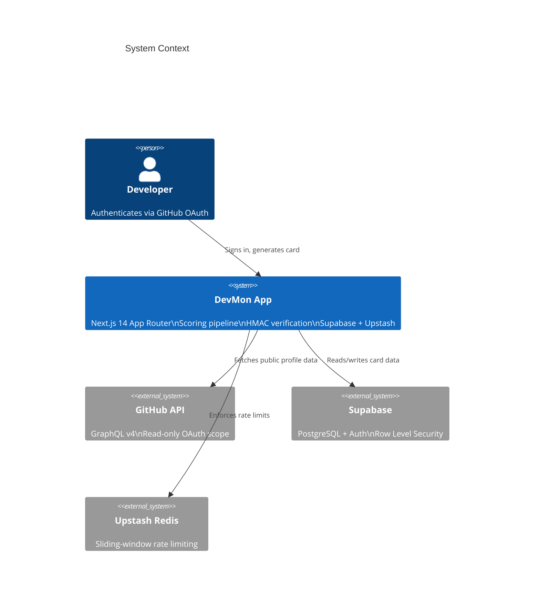
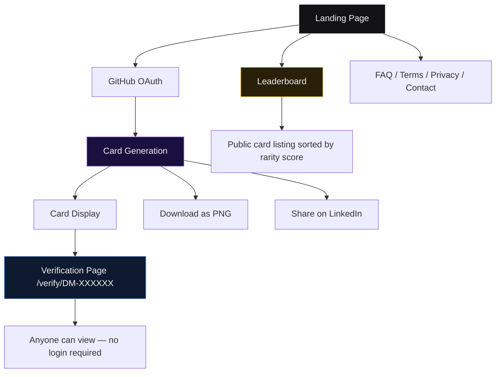
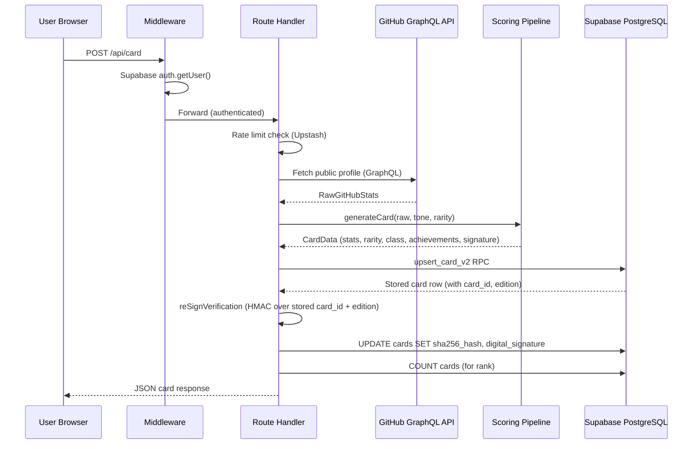
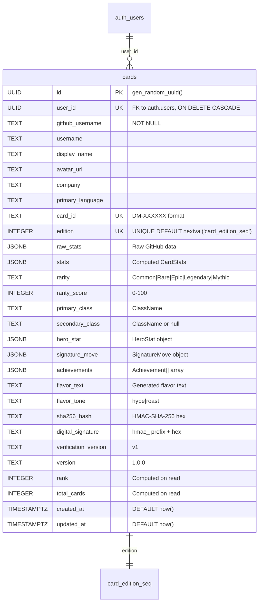
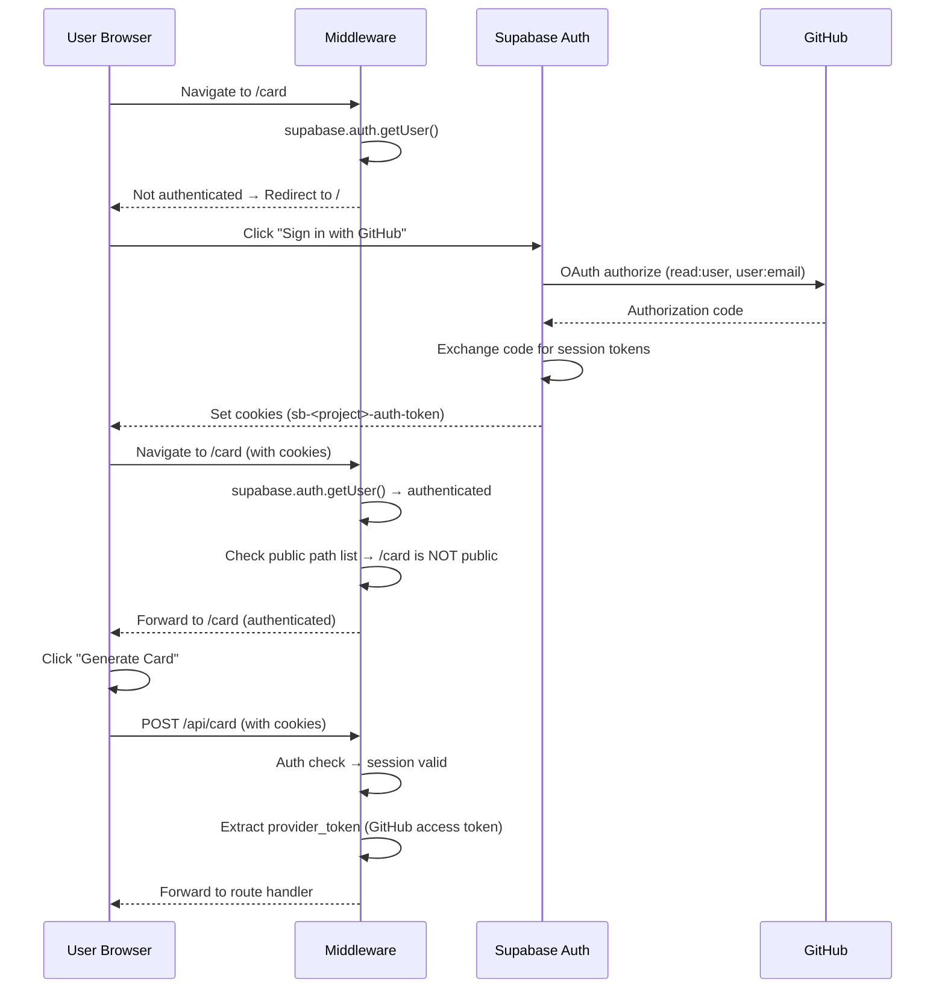
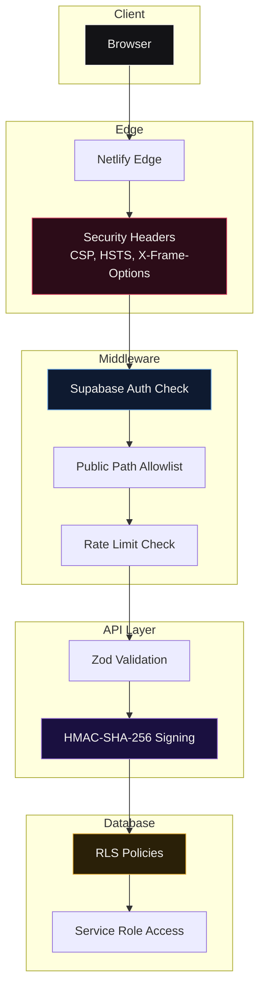

# ARCHITECTURE.md

Complete technical specification for DevMon — a verified developer credential platform powered by public GitHub activity.

---

## 1. System Overview

DevMon is a web application that reads a developer's public GitHub profile via OAuth, computes a set of gameplay-style statistics and a rarity tier, renders a collectible credential card, signs it with an HMAC-SHA-256 cryptographic signature, and serves a public verification page that any third party can inspect without logging in.



**Data flow (card generation):**

1. User authenticates via GitHub OAuth (read-only scope).
2. Server fetches public profile, repositories, contributions, PRs, and issues via the GitHub GraphQL API.
3. The scoring pipeline computes five stat categories, a rarity composite, a developer class, a signature move, six achievements, a hero stat, and flavor text.
4. A unique card ID (`DM-XXXXXX`) is generated and an HMAC-SHA-256 signature is computed over the card payload.
5. The full card row is upserted into the `cards` table via the `upsert_card_v2` RPC function.
6. The signed card is returned to the client for rendering, download, and sharing.

---

## 2. Design Philosophy

**"No tracking, no profiling, no bullshit."**

Every architectural decision in DevMon serves this principle:

- **Zero analytics.** No Google Analytics, no Plausible, no Mixpanel, no custom event tracking. No cookies are set by DevMon.
- **Zero fingerprinting.** No browser fingerprinting libraries, no device identification, no session persistence beyond the Supabase auth token.
- **Read-only OAuth.** The GitHub OAuth scope is limited to `read:user` and `user:email`. DevMon never writes to a user's repositories, creates issues, or posts comments on their behalf.
- **Cryptographic verification.** Every card is signed with an HMAC-SHA-256 signature. Verification is performed server-side against the stored hash — not by trusting the client.
- **Public verification without login.** Anyone with a card ID can verify its authenticity at `/verify/DM-XXXXXX` without needing a GitHub account.

---

## 3. Product Architecture



| Feature | Description |
|---------|-------------|
| Card Generation | Fetches GitHub data, computes stats/rarity/class, signs the card, stores it in Supabase |
| Cryptographic Verification | HMAC-SHA-256 signature over username + stats + rarity + card ID; verifiable by any third party |
| Rarity System | 8-factor composite score mapped to 5 tiers: Common, Rare, Epic, Legendary, Mythic |
| Leaderboard | Public listing of all cards sorted by rarity score, filterable by company |
| Public Verification Pages | `/verify/DM-XXXXXX` shows the full card and signature without requiring login |

---

## 4. Tech Stack

| Category | Technology | Version | Purpose |
|----------|-----------|---------|---------|
| Framework | Next.js | 14.2+ | App Router, Server Components, Route Handlers |
| Language | TypeScript | 5.4+ | Strict mode, bundler module resolution |
| UI Library | React | 18.3+ | Client and Server Components |
| Styling | Tailwind CSS | 3.4+ | Utility-first CSS, design tokens via CSS custom properties |
| Animation | GSAP | 3.15+ | Hardware-accelerated cursor, landing loader |
| Animation | Motion (Framer Motion) | 12.42+ | Page transitions, accordions, card hover effects |
| Export | html-to-image | 1.11+ | Client-side PNG generation for card download |
| QR Code | qrcode.react | 4.2+ | Verification URL QR codes on cards |
| Validation | Zod | 4.4+ | Runtime schema validation for API inputs |
| Auth | Supabase Auth | via `@supabase/ssr` 0.5+ | GitHub OAuth, session management via cookies |
| Database | Supabase PostgreSQL | via `@supabase/supabase-js` 2.45+ | Card storage, RPC functions, RLS policies |
| Rate Limiting | Upstash Redis | via `@upstash/ratelimit` 2.0+ | Sliding-window rate limiting |
| Testing | Vitest | 4.1+ | Unit tests for scoring algorithms |
| Linting | ESLint | 8.57+ | Code quality enforcement |
| Deployment | Netlify | — | Static hosting, edge functions |

---

## 5. Repository Structure

```
DevMon/
├── src/
│   ├── app/                          # Next.js App Router pages
│   │   ├── layout.tsx                # Root layout, global metadata, theme provider (82 lines)
│   │   ├── page.tsx                  # Landing page (890 lines)
│   │   ├── globals.css               # Design system tokens, Tailwind config (716 lines)
│   │   ├── loading.tsx               # Root loading state
│   │   ├── error.tsx                 # Root error boundary
│   │   ├── not-found.tsx             # 404 page
│   │   ├── providers.tsx             # Theme and context providers
│   │   ├── sitemap.ts                # Dynamic sitemap generation
│   │   ├── robots.ts                 # Robots.txt generation
│   │   ├── card/
│   │   │   ├── layout.tsx            # Card page SEO metadata
│   │   │   ├── page.tsx              # Card generation UI (478 lines)
│   │   │   └── error.tsx             # Card page error boundary
│   │   ├── leaderboard/
│   │   │   ├── layout.tsx            # Leaderboard SEO metadata
│   │   │   ├── page.tsx              # Leaderboard display (261 lines)
│   │   │   └── error.tsx             # Leaderboard error boundary
│   │   ├── verify/
│   │   │   └── [cardId]/
│   │   │       ├── page.tsx          # Public verification page (392 lines)
│   │   │       └── error.tsx         # Verification error boundary
│   │   ├── faq/
│   │   │   ├── layout.tsx            # FAQ SEO metadata
│   │   │   └── page.tsx              # FAQ accordion (152 lines)
│   │   ├── terms/page.tsx            # Terms of Service
│   │   ├── privacy/page.tsx          # Privacy Policy
│   │   ├── contact/page.tsx          # Contact page
│   │   └── api/
│   │       ├── card/route.ts         # POST: generate card, GET: card count
│   │       ├── leaderboard/route.ts  # GET: paginated leaderboard
│   │       ├── verify/[cardId]/route.ts # GET: verify card by ID
│   │       ├── og/route.tsx          # GET: generate OG image
│   │       ├── health/route.ts       # GET: health check
│   │       └── auth/
│   │           ├── callback/route.ts # GET: OAuth callback
│   │           └── signout/route.ts  # POST: sign out
│   ├── components/
│   │   ├── CardFace.tsx              # Desktop card renderer (566 lines)
│   │   ├── CardFaceMobile.tsx        # Mobile card renderer (498 lines)
│   │   ├── DownloadButton.tsx        # PNG export + download (402 lines)
│   │   ├── CustomCursor.tsx          # GSAP-powered cursor (145 lines)
│   │   ├── LinkedInShareModal.tsx    # LinkedIn share flow (253 lines)
│   │   ├── MagneticButton.tsx        # Magnetic hover button (52 lines)
│   │   ├── PageTransition.tsx        # AnimatePresence wrapper (19 lines)
│   │   ├── RarityCrown.tsx           # Rarity crown icon
│   │   ├── ThemeToggle.tsx           # Dark/light theme toggle
│   │   ├── Footer.tsx                # Site footer (55 lines)
│   │   └── legal/
│   │       ├── LegalPageKit.tsx      # Reusable legal page layout
│   │       └── ContactForm.tsx       # Contact form component
│   ├── lib/
│   │   ├── scoring.ts                # Scoring pipeline orchestrator (90 lines)
│   │   ├── rarity.ts                 # 8-factor rarity composite (36 lines)
│   │   ├── classes.ts                # 12 developer class rules (113 lines)
│   │   ├── flavor-text.ts            # 40 flavor text templates (111 lines)
│   │   ├── achievements.ts           # 8 achievement types (73 lines)
│   │   ├── signature-move.ts         # 14 signature moves (131 lines)
│   │   ├── hero-stat.ts              # Hero stat selection (108 lines)
│   │   ├── verification.ts           # HMAC-SHA-256 signing (57 lines)
│   │   ├── github.ts                 # GitHub GraphQL fetcher (301 lines)
│   │   ├── validation.ts             # Zod schemas (6 lines)
│   │   ├── rate-limit.ts             # Upstash rate limiter (37 lines)
│   │   ├── auth-helpers.ts           # Session extraction (13 lines)
│   │   ├── motion.ts                 # Framer Motion variants
│   │   ├── theme.tsx                 # Theme context + provider
│   │   └── supabase/
│   │       ├── server.ts             # Server-side Supabase client (25 lines)
│   │       └── client.ts             # Browser-side Supabase client (7 lines)
│   ├── types/
│   │   └── index.ts                  # All types, interfaces, constants (183 lines)
│   └── middleware.ts                 # Auth middleware, public path allowlist (52 lines)
├── supabase/
│   └── full_migration.sql            # Authoritative DB schema (149 lines)
├── archive/
│   └── migrations/
│       ├── 001_init.sql              # Historical initial migration
│       ├── 002_upsert_fix.sql        # Historical upsert fix
│       └── 002_reset_and_fix_edition.sql
├── next.config.mjs                   # Security headers, CSP, image config
├── tailwind.config.ts                # Tailwind theme
├── tsconfig.json                     # TypeScript config
├── package.json                      # Dependencies and scripts
├── README.md                         # Project documentation
├── ARCHITECTURE.md                   # This file
├── DEVELOPER_GUIDE.md                # Setup guide
└── LICENSE                           # AGPL-3.0 license
```

---

## 6. Frontend Architecture

```mermaid
flowchart TD
    subgraph Pages
        LP[Landing Page<br/>src/app/page.tsx]
        CP[Card Generation<br/>src/app/card/page.tsx]
        LB[Leaderboard<br/>src/app/leaderboard/page.tsx]
        VP[Verification<br/>src/app/verify/[cardId]/page.tsx]
        FP[FAQ<br/>src/app/faq/page.tsx]
    end

    subgraph Shared Components
        CF[CardFace.tsx]
        CFM[CardFaceMobile.tsx]
        DB[DownloadButton.tsx]
        CC[CustomCursor.tsx]
        FT[Footer.tsx]
        MB[MagneticButton.tsx]
        PT[PageTransition.tsx]
        RC[RarityCrown.tsx]
        TT[ThemeToggle.tsx]
        LSM[LinkedInShareModal.tsx]
    end

    CP --> CF
    CP --> CFM
    CP --> DB
    CP --> LSM
    VP --> CF
    VP --> CFM
    LB --> FT
    FP --> FT
    LP --> CC
    LP --> MB
    LP --> FT
    PT -.-> LP
    PT -.-> CP
    PT -.-> LB
    PT -.-> VP
    PT -.-> FP

    style LP fill:#131316,stroke:#F2F1EE,color:#F2F1EE
    style CP fill:#1A1040,stroke:#9B72D8,color:#F2F1EE
    style LB fill:#2A2008,stroke:#E0A830,color:#F2F1EE
    style VP fill:#0E1A30,stroke:#5B9AE0,color:#F2F1EE
    style FP fill:#1A1A1E,stroke:#8B8FA0,color:#F2F1EE
```

### Pages

| Page | Route | Rendering | Description |
|------|-------|-----------|-------------|
| Landing | `/` | Static (SSG) | Marketing page, hero, manifesto, features, quotes, CTA |
| Card Generation | `/card` | Dynamic (SSR) | Auth-generate, displays generated card with download/share |
| Leaderboard | `/leaderboard` | Dynamic (SSR) | Paginated card listing sorted by rarity score |
| Verification | `/verify/[cardId]` | Dynamic (SSR) | Public card verification, no auth required |
| FAQ | `/faq` | Static (SSG) | Accordion-style FAQ with 15 questions |
| Terms | `/terms` | Static (SSG) | Terms of Service |
| Privacy | `/privacy` | Static (SSG) | Privacy Policy |
| Contact | `/contact` | Static (SSG) | Contact form/information |

### Design System (from `globals.css`)

All design tokens are defined as CSS custom properties on `:root` and `[data-theme="dark"]` (716 lines of token definitions):

| Token Category | Examples | Purpose |
|---------------|----------|---------|
| `surface-*` | `surface-primary`, `surface-card`, `surface-elevated` | Background layers |
| `text-*` | `text-primary`, `text-secondary`, `text-tertiary` | Typography hierarchy |
| `accent-*` | `accent-primary`, `accent-glow` | Brand accent colors |
| `rarity-*` | `rarity-common`, `rarity-rare`, `rarity-epic`, `rarity-legendary`, `rarity-mythic` | Rarity tier colors |
| `shadow-*` | `shadow-card`, `shadow-elevated` | Elevation system |
| `glow-*` | `glow-rare`, `glow-epic`, `glow-legendary`, `glow-mythic` | Rarity glow effects |
| `border-*` | `border-hairline`, `border-subtle` | Border colors |

### Animation System

| Library | Usage | Location |
|---------|-------|----------|
| GSAP | Custom cursor magnetic effect, landing page loader animation | `CustomCursor.tsx`, `LandingLoader` |
| Motion (Framer Motion) | Page transitions (`AnimatePresence`), FAQ accordions, card hover effects, modal animations | `PageTransition.tsx`, FAQ `AccordionItem`, `LinkedInShareModal.tsx` |

### Mobile-First Responsive Approach

- Two card renderers: `CardFace.tsx` (desktop) and `CardFaceMobile.tsx` (mobile)
- Responsive breakpoints via Tailwind: `sm:`, `md:`, `lg:`, `xl:`
- Landing page uses stacked layout on mobile, side-by-side on desktop
- Leaderboard switches from card grid to list on small screens

---

## 7. Backend Architecture



### API Routes

| Method | Route | Auth | Rate Limit | Description |
|--------|-------|------|------------|-------------|
| `POST` | `/api/card` | Required | 10 req/min per user | Generate or regenerate a card |
| `GET` | `/api/card` | None | — | Return total card count |
| `GET` | `/api/leaderboard` | None | 60 req/min | Paginated leaderboard (supports `?company=` filter) |
| `GET` | `/api/verify/[cardId]` | None | — | Verify a card by its ID |
| `GET` | `/api/og?user=` | None | 5 req/min | Generate OG image for social sharing |
| `GET` | `/api/health` | None | — | Health check (`{ ok: true }`) |
| `GET` | `/api/auth/callback` | None | — | GitHub OAuth callback, exchanges code for session |
| `POST` | `/api/auth/signout` | None | — | Destroy session, redirect to `/` |

### Middleware (`src/middleware.ts`)

The middleware runs on every request (except static assets) and:

1. Creates a Supabase server client with cookie-based session management.
2. Checks if the user is authenticated via `supabase.auth.getUser()`.
3. Compares the pathname against a public path allowlist:
   - Pages: `/`, `/leaderboard`, `/verify/*`, `/faq`, `/terms`, `/privacy`, `/contact`
   - API routes: `/api/auth/*`, `/api/leaderboard/*`, `/api/verify/*`, `/api/og/*`
   - Static: `/_next/*`, `/favicon*`, `*.ico`, `*.svg`, `*.png`
4. If the user is not authenticated and the path is not public, redirects to `/`.

### Rate Limiting

Rate limiting is implemented via Upstash Redis with a sliding-window algorithm:

| Name | Window | Max Requests | Identifier |
|------|--------|--------------|------------|
| `card-gen` | 60 seconds | 10 | User ID (from Supabase session) |
| `reads` | 60 seconds | 60 | IP address |
| `og` | 60 seconds | 5 | IP address |

When Upstash is not configured (local development), rate limiting is bypassed.

### No-Cache Headers

All `/api/*` routes return:
```
Cache-Control: no-store, no-cache, must-revalidate, proxy-revalidate
Surrogate-Control: no-store
Pragma: no-cache
Expires: 0
```

---

## 8. Database Architecture

### Entity Relationship Diagram



### Indexes

| Index | Columns | Type | Purpose |
|-------|---------|------|---------|
| `idx_cards_card_id` | `card_id` | Unique | Fast lookup by card ID for verification |
| `idx_cards_rarity_score` | `rarity_score DESC` | B-tree | Leaderboard sorting |
| `idx_cards_company` | `company` WHERE `company IS NOT NULL` | Partial | Company-filtered leaderboard |

### Row Level Security (RLS)

| Policy | Operation | Condition | Effect |
|--------|-----------|-----------|--------|
| `public read` | SELECT | `true` | Anyone can read any card row |
| `service role full access` | ALL | `auth.role() = 'service_role'` | Service role can read, write, update, delete |

### `upsert_card_v2` RPC Function

The upsert function uses `SELECT FOR UPDATE` to acquire a row-level lock, preventing race conditions during concurrent card generation:

```sql
-- Pseudocode of the upsert logic:
FUNCTION upsert_card_v2(p_user_id, ...params):
    -- 1. Try to lock existing row
    SELECT * INTO existing_row FROM cards WHERE user_id = p_user_id FOR UPDATE;

    IF FOUND THEN
        -- 2a. UPDATE: preserve existing card_id and edition
        UPDATE cards SET ... WHERE user_id = p_user_id RETURNING *;
    ELSE
        -- 2b. INSERT: allocate new edition from sequence
        real_edition := nextval('card_edition_seq');
        INSERT INTO cards (...) VALUES (...) RETURNING *;
    END IF;
```

**Key behaviors:**
- Existing users keep their original `card_id` and `edition` number across regenerations.
- New users get a fresh `card_id` from `generateCardId()` and a new `edition` from the `card_edition_seq` sequence.
- The `SECURITY DEFINER` qualifier means the function executes with the permissions of the function owner (service role), bypassing RLS.

### Migration Strategy

- **Authoritative source:** `supabase/full_migration.sql` — the single file to run against a clean database.
- **Historical snapshots:** `archive/migrations/` contains the original `001_init.sql`, `002_upsert_fix.sql`, and `002_reset_and_fix_edition.sql` for reference only.
- The `full_migration.sql` drops all legacy tables (`profiles`, `leaderboard`, `editions`, `card_count`) and functions before creating the current schema.

---

## 9. Auth Architecture



### OAuth Flow

1. User clicks "Sign in with GitHub" on the landing page.
2. Supabase Auth redirects to GitHub's OAuth authorize endpoint with scopes `read:user` and `user:email`.
3. GitHub redirects back to `/api/auth/callback` with an authorization code.
4. The callback route exchanges the code for a Supabase session and stores it in HTTP-only cookies.
5. The GitHub access token is stored as `provider_token` in the Supabase session, accessible via `supabase.auth.getSession()`.

### Session Management

- Sessions are managed entirely by Supabase via HTTP-only cookies (`sb-<project-ref>-auth-token`).
- The middleware reads cookies on every request to determine authentication state.
- The `getSessionUser()` helper in `src/lib/auth-helpers.ts` extracts the user ID and GitHub access token from the session.

### Public Path Allowlist

The middleware allows unauthenticated access to:

| Path Pattern | Purpose |
|-------------|---------|
| `/` | Landing page |
| `/leaderboard` | Public leaderboard |
| `/verify/*` | Public card verification |
| `/faq` | FAQ page |
| `/terms` | Terms of Service |
| `/privacy` | Privacy Policy |
| `/contact` | Contact page |
| `/api/auth/*` | OAuth callback and signout |
| `/api/leaderboard/*` | Public leaderboard API |
| `/api/verify/*` | Public verification API |
| `/api/og/*` | OG image generation |
| `/_next/*` | Next.js static assets |
| `/favicon*`, `*.ico`, `*.svg`, `*.png` | Static assets |

---

## 10. Algorithms

### 10.1 Scoring Pipeline (`src/lib/scoring.ts`)

The `generateCard()` function orchestrates the entire pipeline:

```
Input:  RawGitHubStats (fetched from GitHub GraphQL API)
Output: CardData (complete card with all computed fields)

Pipeline:
  1. computeStats(raw)        → CardStats (5 categories, 0-100 each)
  2. computeRarity(raw)       → rarityScore (0-100)
  3. getRarityFromScore(score) → Rarity tier
  4. assignClasses(raw, stats) → primary + secondary class
  5. generateFlavorText(...)  → flavor text string
  6. generateSignatureMove(raw, stats) → SignatureMove
  7. generateAchievements(raw, stats)  → Achievement[] (top 6)
  8. selectHeroStat(raw, stats) → HeroStat
  9. generateVerification(raw, stats, rarity, edition) → VerificationData
```

**Helper functions:**

```typescript
logScale(value, factor=10, max=100):
    return min(max, round(log2(value + 1) * factor))

clamp(v):
    return min(100, max(0, round(v)))
```

#### Merge Force

```
mergeForce = clamp(
    logScale(mergedPRs, 10) * 0.5 +
    logScale(closedIssues, 10) * 0.3 +
    min(100, mergedPRs * 0.8) * 0.2
)
```

**Example:** Developer with 50 merged PRs and 30 closed issues:
- `logScale(50, 10) = min(100, round(log2(51) * 10)) = round(5.672 * 10) = 57`
- `logScale(30, 10) = min(100, round(log2(31) * 10)) = round(4.954 * 10) = 50`
- `min(100, 50 * 0.8) = 40`
- `mergeForce = clamp(57 * 0.5 + 50 * 0.3 + 40 * 0.2) = clamp(28.5 + 15 + 8) = clamp(51.5) = 52`

#### Code Velocity

```
streakComponent = min(100, currentStreak * 6)
recentComponent = logScale(recentCommits, 18)
codeVelocity = clamp(
    recentComponent * 0.6 +
    streakComponent * 0.3 +
    logScale(totalCommits, 8) * 0.1
)
```

**Example:** 45 recent commits, 14-day streak, 2000 total commits:
- `recentComponent = logScale(45, 18) = min(100, round(log2(46) * 18)) = round(5.524 * 18) = 99`
- `streakComponent = min(100, 14 * 6) = 84`
- `logScale(2000, 8) = min(100, round(log2(2001) * 8)) = round(10.97 * 8) = 88`
- `codeVelocity = clamp(99 * 0.6 + 84 * 0.3 + 88 * 0.1) = clamp(59.4 + 25.2 + 8.8) = clamp(93.4) = 93`

#### Problem Solving

```
prTotal = mergedPRs + closedIssues
prCloseRate = prTotal > 0 ? closedIssues / prTotal : 0
closeRateScore = clamp(prCloseRate * 120)
volumeScore = logScale(prTotal, 10)
issueDepth = closedIssues > 0 ? min(100, closedIssues * 1.5) : 0
problemSolving = clamp(
    closeRateScore * 0.4 +
    volumeScore * 0.35 +
    issueDepth * 0.25
)
```

#### Open Source

```
collabBase = contributedTo * 6 + orgCount * 12
forkEngagement = forkedRepos > 0 ? min(40, forkedRepos * 4) : 0
communityPresence = min(30, followers * 0.5)
openSource = clamp(collabBase + forkEngagement + communityPresence)
```

#### Consistency

```
longestStreakScore = min(100, longestStreak * 4)
currentStreakBonus = min(100, currentStreak * 6)
regularity = totalRepos > 0 ? min(100, (totalCommits / totalRepos) * 2) : 0
consistency = clamp(
    longestStreakScore * 0.4 +
    currentStreakBonus * 0.35 +
    regularity * 0.25
)
```

---

### 10.2 Rarity System (`src/lib/rarity.ts`)

The rarity score is an 8-factor composite using logarithmic percentile scoring:

```typescript
logCentile(value, target, strictness=1):
    ratio = value / target
    score = log10(ratio + 1) * 50 * strictness
    return min(100, round(score))
```

**Factor weights:**

| Factor | Weight | Target | Strictness | Formula |
|--------|--------|--------|------------|---------|
| Followers | 0.15 | 100 | 2 | `logCentile(followers, 100, 2)` |
| Total Stars | 0.20 | 500 | 2 | `logCentile(totalStars, 500, 2)` |
| Total Commits | 0.15 | 1000 | 2 | `logCentile(totalCommits, 1000, 2)` |
| Recent Commits | 0.10 | 200 | 2 | `logCentile(recentCommits, 200, 2)` |
| Merged PRs | 0.10 | 100 | 2 | `logCentile(mergedPRs, 100, 2)` |
| Closed Issues | 0.10 | 100 | 2 | `logCentile(closedIssues, 100, 2)` |
| Account Age | 0.10 | — | — | `ageScore(createdAt)` |
| Organizations | 0.10 | — | — | `min(100, orgCount * 20)` |

**Composite formula:**

```
composite = (
    followerScore * 0.15 +
    starScore * 0.20 +
    commitScore * 0.15 +
    contribScore * 0.10 +
    prScore * 0.10 +
    issueScore * 0.10 +
    age * 0.10 +
    orgScore * 0.10
)
rarityScore = round(min(100, composite))
```

**Account age scoring:**

| Age | Score |
|-----|-------|
| >= 10 years | 100 |
| >= 5 years | 80 |
| >= 3 years | 60 |
| >= 1 year | 30 |
| < 1 year | 10 |

**Example:** Developer with 200 followers, 1000 stars, 3000 commits, 100 recent commits, 50 merged PRs, 30 closed issues, 5-year account age, 3 organizations:
- `followerScore = logCentile(200, 100, 2) = min(100, round(log10(3) * 100)) = round(47.7) = 48`
- `starScore = logCentile(1000, 500, 2) = min(100, round(log10(3) * 100)) = round(47.7) = 48`
- `commitScore = logCentile(3000, 1000, 2) = min(100, round(log10(4) * 100)) = round(60.2) = 60`
- `contribScore = logCentile(100, 200, 2) = min(100, round(log10(1.5) * 100)) = round(17.6) = 18`
- `prScore = logCentile(50, 100, 2) = min(100, round(log10(1.5) * 100)) = round(17.6) = 18`
- `issueScore = logCentile(30, 100, 2) = min(100, round(log10(1.3) * 100)) = round(11.4) = 11`
- `age = 80` (5-year account)
- `orgScore = min(100, 3 * 20) = 60`
- `composite = 48*0.15 + 48*0.20 + 60*0.15 + 18*0.10 + 18*0.10 + 11*0.10 + 80*0.10 + 60*0.10 = 7.2 + 9.6 + 9.0 + 1.8 + 1.8 + 1.1 + 8.0 + 6.0 = 44.5`
- `rarityScore = 45` → **Rare** tier

---

### 10.3 Rarity Tier Thresholds (`src/lib/scoring.ts`)

```typescript
getRarityFromScore(score):
    if score >= 97  → "Mythic"
    if score >= 89  → "Legendary"
    if score >= 71  → "Epic"
    if score >= 46  → "Rare"
    else            → "Common"
```

| Tier | Score Range | Approximate % of Developers |
|------|-------------|---------------------------|
| Common | 0–45 | ~60% |
| Rare | 46–70 | ~25% |
| Epic | 71–88 | ~10% |
| Legendary | 89–96 | ~4% |
| Mythic | 97–100 | ~1% |

---

### 10.4 Developer Classes (`src/lib/classes.ts`)

12 classes, each with a scoring function applied to the developer's raw stats and computed card stats:

| Class | Scoring Formula | Trigger Condition |
|-------|----------------|-------------------|
| **PR Titan** | `min(100, mergedPRs * 1.8)` | High PR merge count |
| **Bug Hunter** | `min(100, closedIssues * 1.5 + ratio * 40)` where `ratio = closedIssues / (mergedPRs + closedIssues)` | High issue close rate |
| **Night Owl** | `85` if >30% of commits are between 00:00–05:00, else `0` | Night-time commit pattern |
| **Fork Warden** | `min(100, forkedRepos / originalRepos * 30)` | High fork-to-original ratio |
| **Commit Phantom** | `90` if any repo was pushed to >1 year after creation and <90 days ago, else `0` | Necro-commit pattern |
| **Open Source Sentinel** | `min(100, contributedTo * 5 + orgCount * 15)` | High external contributions |
| **Merge Griffin** | `min(100, mergedPRs * 1.2 + velocityBonus)` where `velocityBonus = 20 if codeVelocity > 70 else 0` | PR merges + high velocity |
| **Stack Guardian** | `min(100, min(60, originalRepos * 3) + min(40, languages.length * 8))` | Broad repo + language coverage |
| **Polyglot Artisan** | `min(100, languages.length * 12)` | Many programming languages |
| **Code Archivist** | `min(100, archivedRepos * 15 + originalRepos * 2)` | Many archived repos |
| **Green Sprout** | `min(100, originalRepos * 5 + activityBonus)` if account age < 2 years, else `0` | New developer with activity |
| **Zen Coder** | `min(100, cleanRatio * 80 + originalRepos * 2)` where `cleanRatio = zeroStarRepos / originalRepos` if >5 repos, else `0` | Many zero-star repos (clean code) |

**Classification logic:**

1. Score all 12 rules against the developer's stats.
2. Sort by score descending, filter out zeros.
3. Highest-scoring class becomes `primary`.
4. Second-highest becomes `secondary` (if score > 0).
5. If no class scores above 0, default to `Stack Guardian`.

**Example:** Developer with 80 merged PRs, 15 closed issues, 5 languages, 20 original repos:
- PR Titan: `min(100, 80 * 1.8) = 100`
- Bug Hunter: `min(100, 15 * 1.5 + (15/95) * 40) = min(100, 22.5 + 6.3) = 29`
- Stack Guardian: `min(100, min(60, 20*3) + min(40, 5*8)) = min(100, 60 + 40) = 100`
- Polyglot Artisan: `min(100, 5 * 12) = 60`

→ **Primary: PR Titan** (100, ties broken by order), **Secondary: Stack Guardian** (100)

---

### 10.5 Signature Moves (`src/lib/signature-move.ts`)

14 moves, each with a scoring function. The highest-scoring move wins:

| Move | Scoring Formula | Icon |
|------|----------------|------|
| PR Storm | `min(100, mergedPRs * 2)` | M |
| Recursive Refactor | `min(100, totalCommits * 0.1 + (originalRepos > 10 ? 30 : 0))` | R |
| Production Shield | `min(100, closedIssues * 2)` | P |
| Commit Barrage | `min(100, recentCommits * 1.5)` | C |
| Infinite Merge | `min(100, currentStreak * 6 + longestStreak * 2)` | I |
| Cherry Pick Strike | `min(100, contributedTo * 8)` | S |
| Dependency Crusher | `min(100, forkedRepos * 4)` | D |
| Star Forge | `min(100, totalStars * 0.5)` | ★ |
| Branch Collapse | `min(100, originalRepos * 3)` | B |
| Language Weaver | `min(100, languages.length * 14)` | L |
| Night Shift | `80` if >30% commits 00:00–05:00, else `0` | N |
| Community Pulse | `min(100, followers * 1.5)` | ♥ |
| Necro Commit | `85` if any repo pushed >1yr after creation and <90 days ago, else `0` | Z |
| Stack Sovereign | `min(100, originalRepos * 2 + languages.length * 10)` | K |

**Description interpolation:** Variables like `{{prs}}`, `{{commits}}`, `{{issues}}`, etc. are replaced with actual values from the developer's stats.

---

### 10.6 Achievements (`src/lib/achievements.ts`)

8 achievement types, top 6 by priority score:

| Achievement | Value | Priority Formula | Icon |
|-------------|-------|-----------------|------|
| Stars | `totalStars` (formatted) | `min(100, totalStars * 0.3)` | ★ |
| Day Streak | `longestStreak` | `min(100, longestStreak * 3)` | F |
| Repositories | `originalRepos` | `min(100, originalRepos * 2.5)` | R |
| Languages | `languages.length` | `min(100, languages.length * 12)` | L |
| Contributions | `totalCommits` (formatted) | `min(100, totalCommits * 0.08)` | C |
| PRs Merged | `mergedPRs` (formatted) | `min(100, mergedPRs * 1.2)` | M |
| Followers | `followers` (formatted) | `min(100, followers * 1.5)` | ♥ |
| Issues Closed | `closedIssues` (formatted) | `min(100, closedIssues * 1.2)` | X |

Numbers >= 1000 are formatted as `1.2K`.

---

### 10.7 Hero Stat (`src/lib/hero-stat.ts`)

Selects the single most impressive stat to display prominently on the card:

| Candidate | Weight Formula | Unit | Qualifier |
|-----------|---------------|------|-----------|
| Stars | `totalStars * 3` | ★ | earned |
| Contributions | `totalCommits * 0.5` | — | all time |
| Day Streak | `longestStreak * 8` | days | maintained |
| PRs Shipped | `mergedPRs * 4` | — | shipped |
| Repos Built | `originalRepos * 5` | — | built |
| Languages | `languages.length * 10` | — | mastered |
| Followers | `followers * 2` | — | watching |
| Repos Contributed To | `contributedTo * 6` | — | supported |
| Consistency Score | `stats.consistency * 2` | /100 | earned |

**Logic:** Filter out candidates with value 0, sort by weight descending, return the top candidate.

---

### 10.8 Flavor Text (`src/lib/flavor-text.ts`)

40 templates split between two tones:

- **Hype (celebratory):** 30 templates — positive, celebratory language
- **Roast (brutally honest):** 10 templates — self-deprecating, humorous

**Template interpolation variables:**

| Variable | Source |
|----------|--------|
| `{{stars}}` | `raw.totalStars` |
| `{{repos}}` | `raw.totalRepos` |
| `{{totalCommits}}` | `raw.totalCommits` |
| `{{recentCommits}}` | `raw.recentCommits` |
| `{{langCount}}` | `raw.languages.length` |
| `{{topLang}}` | `raw.languages[0].name` |
| `{{currentStreak}}` | `raw.currentStreak` |
| `{{longestStreak}}` | `raw.longestStreak` |
| `{{prsMerged}}` | `raw.mergedPRs` |
| `{{closedIssues}}` | `raw.closedIssues` |
| `{{orgCount}}` | `raw.orgCount` |
| `{{contributedTo}}` | `raw.contributedTo` |
| `{{rarity}}` | Assigned rarity tier |
| `{{className}}` | Assigned class name |
| `{{stats.mergeForce}}` | Computed merge force |
| `{{stats.codeVelocity}}` | Computed code velocity |

**Selection:** Random template from the chosen tone's pool, interpolated with the developer's stats.

---

### 10.9 Card ID Generation (`src/lib/verification.ts`)

```
Format: DM-XXXXXX
Charset: ABCDEFGHJKLMNPQRSTUVWXYZ23456789 (32 chars, no ambiguous I/1/0/O)
Length: 6 alphanumeric characters after "DM-" prefix
Entropy: 32^6 = 1,073,741,824 possible IDs
Generation: crypto.randomBytes(6) → each byte mod 32 → index into charset
```

**HMAC-SHA-256 signature:**

```
payload = JSON.stringify({ username, stats, rarity, cardId })
signature = HMAC-SHA-256(payload, HMAC_SECRET)
digital_signature = "hmac_" + signature_hex
```

---

## 11. Mathematical Formulas

### Logarithmic Scaling

Used across scoring and rarity calculations to compress wide value ranges:

```
logScale(value, factor=10, max=100) = min(max, round(log2(value + 1) * factor))
logCentile(value, target, strictness=1) = min(100, round(log10(value/target + 1) * 50 * strictness))
```

### Normalization

All stats are normalized to 0–100 range via the `clamp()` function:

```
clamp(v) = min(100, max(0, round(v)))
```

### Percentile Rank

The `logCentile` function approximates percentile ranking against a target value. For example, a developer with 500 stars against a target of 500 scores ~48/100, meaning they are roughly at the 48th percentile relative to that target.

### Card ID Entropy

```
Total possible card IDs = 32^6 = 1,073,741,824 (~1 billion)
Collision probability at 10,000 cards: ≈ 0.0046%
```

---

## 12. Security Architecture



### Security Headers (from `next.config.mjs`)

| Header | Value | Purpose |
|--------|-------|---------|
| `X-Content-Type-Options` | `nosniff` | Prevents MIME-type sniffing |
| `X-Frame-Options` | `DENY` | Prevents clickjacking |
| `X-XSS-Protection` | `1; mode=block` | XSS filter in legacy browsers |
| `Referrer-Policy` | `strict-origin-when-cross-origin` | Limits referrer information |
| `Permissions-Policy` | `camera=(), microphone=(), geolocation=()` | Disables browser features |
| `Strict-Transport-Security` | `max-age=63072000; includeSubDomains; preload` | Forces HTTPS for 2 years |
| `Content-Security-Policy` | See below | Restricts resource loading |

### Content Security Policy

```
default-src 'self'
script-src 'self' 'unsafe-eval' 'unsafe-inline' https://www.googletagmanager.com
style-src 'self' 'unsafe-inline' https://fonts.googleapis.com
font-src 'self' https://fonts.gstatic.com
img-src 'self' data: blob: https://avatars.githubusercontent.com https://*.githubusercontent.com
connect-src 'self' https://*.supabase.co https://api.github.com https://avatars.githubusercontent.com https://*.githubusercontent.com
frame-ancestors 'none'
```

### Cryptographic Verification

- **Algorithm:** HMAC-SHA-256
- **Secret:** `HMAC_SECRET` environment variable
- **Payload:** `JSON.stringify({ username, stats, rarity, cardId })`
- **Storage:** `sha256_hash` (hex) and `digital_signature` (`hmac_` prefix + hex)
- **Verification:** Any third party can re-compute the HMAC using the public card data and the known secret to verify authenticity

### Environment Variables

| Variable | Client | Purpose |
|----------|--------|---------|
| `NEXT_PUBLIC_SUPABASE_URL` | Yes | Supabase project URL |
| `NEXT_PUBLIC_SUPABASE_ANON_KEY` | Yes | Supabase anonymous key |
| `SUPABASE_SERVICE_ROLE_KEY` | No | Supabase service role (bypasses RLS) |
| `GITHUB_TOKEN` | No | GitHub personal access token for API calls |
| `UPSTASH_REDIS_REST_URL` | No | Upstash Redis endpoint |
| `UPSTASH_REDIS_REST_TOKEN` | No | Upstash Redis auth token |
| `HMAC_SECRET` | No | HMAC signing secret |
| `NEXT_PUBLIC_SITE_URL` | Yes | Site URL for OG images and redirects |

---

## 13. API Reference

### `POST /api/card`

Generate or regenerate a developer card.

**Auth:** Required (Supabase session with GitHub provider token)
**Rate Limit:** 10 requests per minute per user

**Request body (optional):**
```json
{
  "tone": "hype" | "roast",
  "rarity": "Common" | "Rare" | "Epic" | "Legendary" | "Mythic"
}
```

**Response (200):**
```json
{
  "card": {
    "username": "octocat",
    "displayName": "The Octocat",
    "avatarUrl": "https://avatars.githubusercontent.com/u/1?v=4",
    "stats": { "mergeForce": 72, "codeVelocity": 85, "problemSolving": 64, "openSource": 91, "consistency": 78 },
    "rarity": "Epic",
    "rarityScore": 75,
    "primaryClass": "Open Source Sentinel",
    "secondaryClass": "Merge Griffin",
    "flavorText": "A true Open Source Sentinel...",
    "signatureMove": { "name": "Community Pulse", "description": "120 developers watching the journey", "icon": "♥" },
    "achievements": [{ "label": "Stars", "value": "1.2K", "icon": "★" }],
    "verification": {
      "cardId": "DM-A3B7K9",
      "edition": 1,
      "generatedAt": "2026-07-15T12:00:00.000Z",
      "version": "1.0.0",
      "sha256Hash": "a1b2c3...",
      "digitalSignature": "hmac_a1b2c3..."
    },
    "heroStat": { "key": "openSource", "label": "Repos Contributed To", "value": "45", "unit": "", "qualifier": "supported" },
    "className": "Open Source Sentinel",
    "generatedAt": "2026-07-15T12:00:00.000Z",
    "rank": 3,
    "totalCards": 150
  }
}
```

**Error responses:**
- `401` — Unauthorized (no session)
- `429` — Rate limit exceeded
- `500` — Card generation failed

---

### `GET /api/leaderboard`

Retrieve the public leaderboard.

**Auth:** None
**Rate Limit:** 60 requests per minute

**Query parameters:**
| Parameter | Type | Default | Description |
|-----------|------|---------|-------------|
| `company` | string | — | Filter by company name |
| `limit` | number | 20 | Results per page (max 100) |
| `offset` | number | 0 | Pagination offset |

**Response (200):**
```json
{
  "entries": [
    {
      "username": "octocat",
      "displayName": "The Octocat",
      "avatarUrl": "...",
      "rarity": "Legendary",
      "rarityScore": 92,
      "primaryClass": "PR Titan",
      "stats": { "mergeForce": 95, "codeVelocity": 88, "problemSolving": 72, "openSource": 80, "consistency": 90 },
      "company": "GitHub",
      "primaryLanguage": "TypeScript",
      "generatedAt": "2026-07-15T12:00:00.000Z"
    }
  ],
  "total": 20
}
```

---

### `GET /api/verify/[cardId]`

Verify a card by its unique ID.

**Auth:** None

**Path parameters:**
| Parameter | Format | Example |
|-----------|--------|---------|
| `cardId` | `DM-[A-Z0-9]{6}` | `DM-A3B7K9` |

**Response (200):**
```json
{
  "verified": true,
  "card": {
    "username": "octocat",
    "displayName": "The Octocat",
    "avatarUrl": "...",
    "rarity": "Epic",
    "rarityScore": 75,
    "primaryClass": "Open Source Sentinel",
    "stats": { ... },
    "verification": {
      "cardId": "DM-A3B7K9",
      "edition": 1,
      "generatedAt": "2026-07-15T12:00:00.000Z",
      "version": "1.0.0",
      "digitalSignature": "hmac_a1b2c3...",
      "sha256Hash": "a1b2c3..."
    }
  }
}
```

**Error responses:**
- `400` — Invalid card ID format
- `404` — Card not found
- `500` — Database error

---

### `GET /api/og?user=`

Generate an Open Graph image for social sharing.

**Query parameters:**
| Parameter | Required | Description |
|-----------|----------|-------------|
| `user` or `username` | Yes | GitHub username |

**Response:** PNG image (800x500) with `Cache-Control: public, max-age=86400`

---

### `GET /api/health`

Health check endpoint.

**Response (200):** `{ "ok": true }`

---

## 14. Performance Considerations

### Rendering Strategy

| Page | Strategy | Reason |
|------|----------|--------|
| Landing (`/`) | Static (SSG) | No dynamic data, marketing content only |
| FAQ (`/faq`) | Static (SSG) | Static content, no user data |
| Terms, Privacy, Contact | Static (SSG) | Static legal content |
| Card (`/card`) | Dynamic (SSR) | Requires auth, fetches fresh GitHub data |
| Leaderboard (`/leaderboard`) | Dynamic (SSR) | Reads from database, changes on each card generation |
| Verification (`/verify/[cardId]`) | Dynamic (SSR) | Reads from database by card ID |

### Caching Strategy

- **API routes:** No-cache (`no-store, no-cache, must-revalidate`) — fresh data on every request.
- **OG images:** 24-hour cache (`max-age=86400, s-maxage=86400, stale-while-revalidate=604800`).
- **Static pages:** Next.js ISR with revalidation.

### Client-Side Performance

- **PNG export:** `html-to-image` renders the card DOM node to a canvas on the client, avoiding server-side screenshot infrastructure.
- **GSAP animations:** Hardware-accelerated via `transform` and `opacity` properties.
- **Image optimization:** Next.js `<Image>` component for GitHub avatars with automatic format negotiation.
- **Code splitting:** Next.js App Router automatically splits code by route.

---

## 15. Deployment

### Netlify Configuration

| Setting | Value |
|---------|-------|
| Build command | `next build` |
| Publish directory | `.next` |
| Node.js version | 18+ |
| Site URL | `https://dev-mon.netlify.app/` |

### Environment Variables Checklist

| Variable | Required | Notes |
|----------|----------|-------|
| `NEXT_PUBLIC_SUPABASE_URL` | Yes | From Supabase dashboard |
| `NEXT_PUBLIC_SUPABASE_ANON_KEY` | Yes | From Supabase dashboard |
| `SUPABASE_SERVICE_ROLE_KEY` | Yes | From Supabase dashboard, keep secret |
| `GITHUB_TOKEN` | Yes | Personal access token for GitHub API |
| `UPSTASH_REDIS_REST_URL` | Yes | From Upstash dashboard |
| `UPSTASH_REDIS_REST_TOKEN` | Yes | From Upstash dashboard |
| `HMAC_SECRET` | Yes | Random string for HMAC signing |
| `NEXT_PUBLIC_SITE_URL` | Yes | `https://dev-mon.netlify.app/` |

### Build & Deploy

```bash
# Local development
npm run dev

# Production build
npm run build

# Run tests
npm run test

# Lint
npm run lint
```

---

## 16. Monitoring and Observability

### Health Check

- `GET /api/health` returns `{ "ok": true }` — suitable for uptime monitoring services (e.g., UptimeRobot, BetterStack).

### Logging

- Card generation logs structured JSON to stdout:
  ```json
  {
    "method": "POST",
    "route": "/api/card",
    "userId": "uuid",
    "cardId": "DM-XXXXXX",
    "duration": 2340
  }
  ```
- Errors logged via `console.error` with context (e.g., `upsert_card error:`, `verify query error:`).

### External Dashboards

- **Supabase Dashboard:** Database metrics, auth logs, API usage.
- **Upstash Dashboard:** Rate limiting metrics, request counts, latency.

### Zero-Tracking Philosophy

No external error tracking (Sentry, Bugsnag), no analytics (Google Analytics, Plausible), no A/B testing tools. Consistent with the design philosophy.

---

## 17. Scalability Considerations

### Horizontal Scaling

- **Netlify Edge:** Static pages served from CDN edge nodes globally.
- **Supabase:** Managed PostgreSQL with automatic connection pooling and horizontal read replicas.
- **Upstash Redis:** Serverless Redis with automatic scaling.

### Database Optimization

- Indexes on `card_id` (unique lookup), `rarity_score` (leaderboard sorting), and `company` (partial index for filtered queries).
- Single-table design avoids JOIN overhead.
- `upsert_card_v2` uses `SELECT FOR UPDATE` row-level locking to prevent race conditions.

### Current Limitations

| Bottleneck | Impact | Mitigation |
|-----------|--------|------------|
| GitHub API rate limits | Card generation unavailable if rate limited | Token rotation, error handling |
| No caching layer for card data | Every leaderboard/verification query hits the database | Could add Redis caching |
| No CDN for API responses | Dynamic routes served from origin | Netlify edge functions could help |
| Single Supabase region | Higher latency for distant users | Supabase supports read replicas |

---

## 18. Technical Debt

| Item | Location | Impact | Priority |
|------|----------|--------|----------|
| Archived migrations not version-controlled | `archive/migrations/` | Historical reference only, no active impact | Low |
| `full_migration.sql` not managed by Supabase CLI | `supabase/full_migration.sql` | Manual schema management | Medium |
| No test coverage for API routes | `src/app/api/*/route.ts` | Untested request handling, auth, error paths | High |
| No CI/CD pipeline | Repository root | No automated testing or deployment | High |
| No error tracking service | — | Errors only visible in server logs | Medium |
| No TypeScript strictNullChecks for all components | Various | Potential null reference bugs | Low |
| OG image generation uses `process.env.GITHUB_TOKEN` directly | `src/app/api/og/route.tsx` | Fallback to Supabase cache on failure, but no retry logic | Low |

---

## 19. Known Limitations

| Limitation | Description |
|-----------|-------------|
| No offline support | No service worker, no offline card caching |
| No card versioning/history | Regeneration replaces the previous card; no audit trail of past cards |
| No batch operations | Cards must be generated one at a time |
| No webhook integrations | No Slack/Discord notifications on card generation |
| Rate limiting is per-user for card gen, per-IP for reads | IP-based limits may affect shared networks |
| GitHub API availability | Card generation fails if GitHub API is down or rate limited |
| No card comparison feature | Cannot compare two cards side by side |
| No team/organization cards | Only individual developer cards |
| No custom card themes | Rarity-tier themes only; no user-customizable colors/layouts |

---

## 20. Future Architecture Considerations

| Feature | Description | Architecture Impact |
|---------|-------------|---------------------|
| Card versioning/history | Store all past card versions, allow viewing previous editions | New `card_history` table or JSONB array |
| Team/organization cards | Aggregate stats across multiple developers | New `teams` table, aggregation pipeline |
| API for third-party integrations | Public API with API keys for external consumers | New auth layer, rate limiting per API key |
| Card comparison | Side-by-side comparison of two developers | New comparison endpoint, diff visualization |
| Custom card themes | User-selectable color schemes and layouts | Theme storage, rendering variations |
| Caching layer | Redis cache for leaderboard and verification data | Cache invalidation on card generation |
| Analytics (opt-in) | Privacy-respecting, opt-in usage statistics | Separate analytics service, user consent |
| Multi-language support | i18n for UI text and flavor text | i18n framework, translation files |
