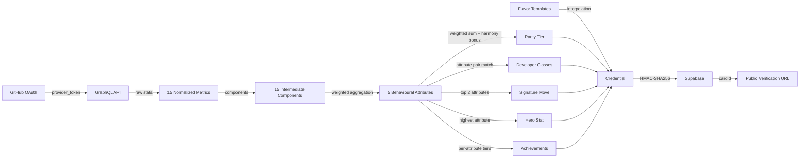
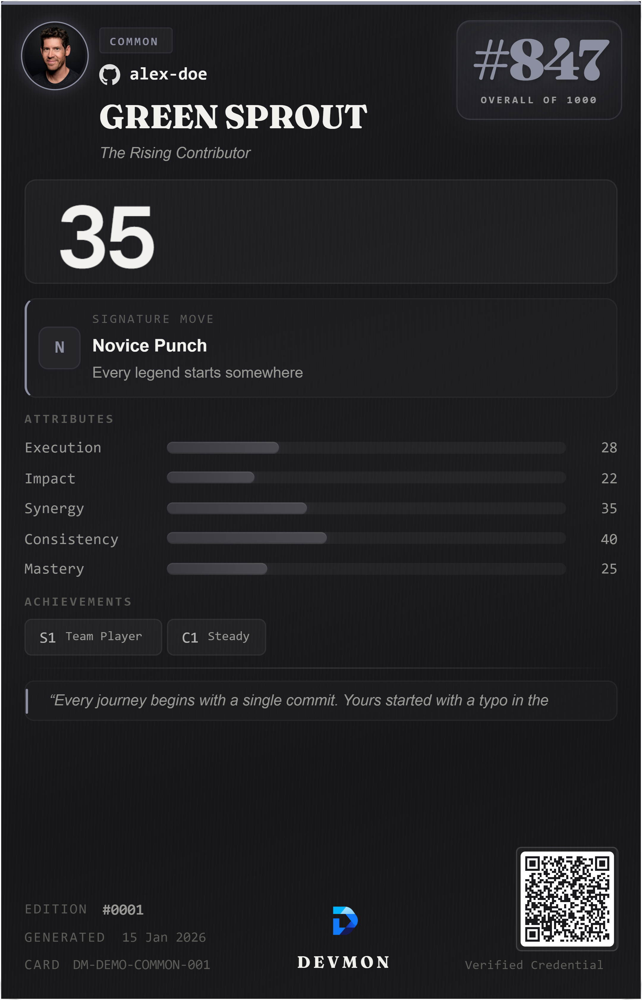
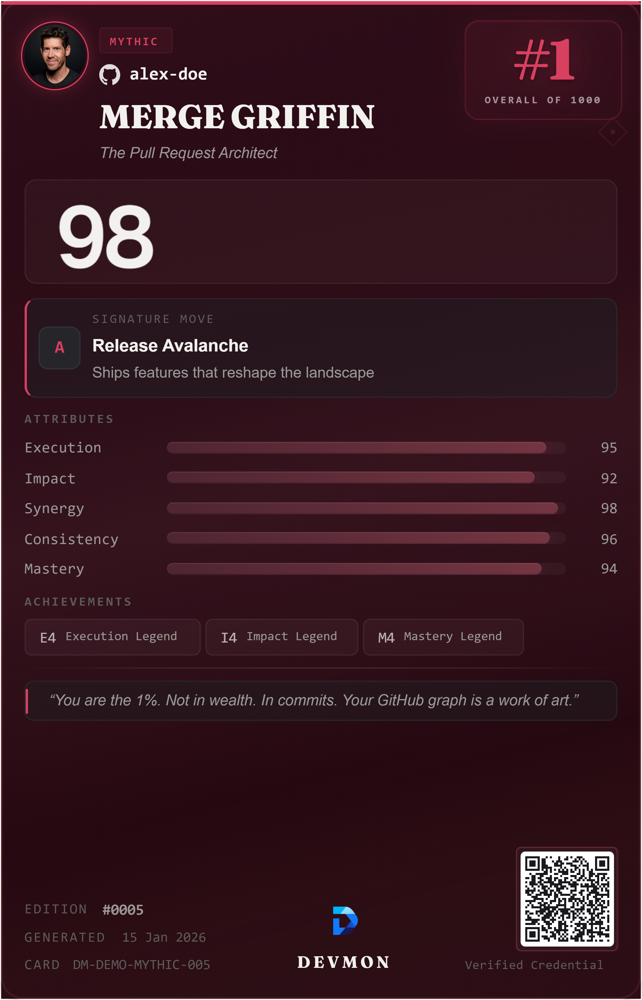
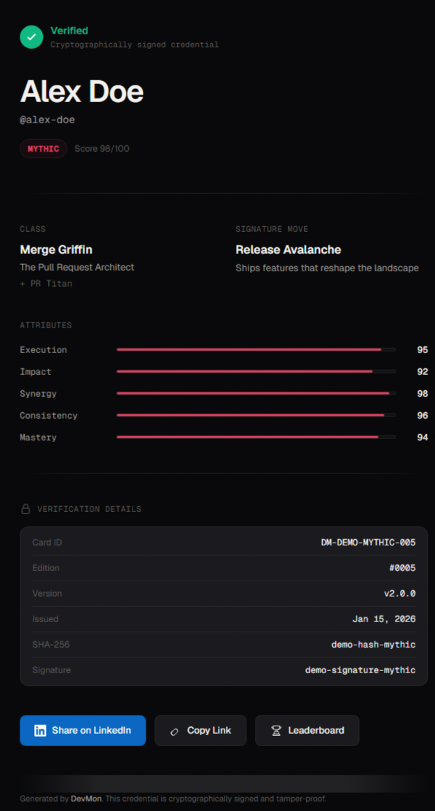
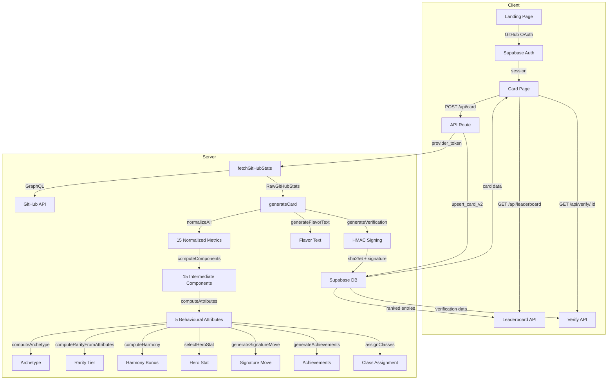
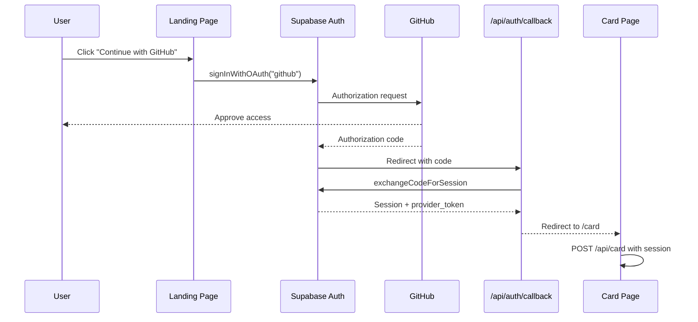
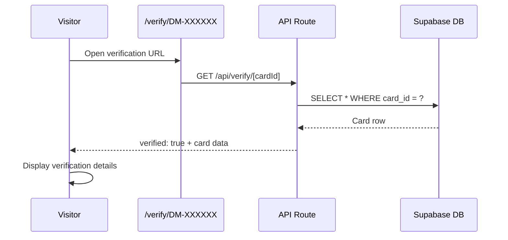

<div align="center">


# DevMon

**Verified developer credentials from your public GitHub activity.**

DevMon reads your public GitHub data through the GraphQL API, normalizes it into 15 metrics, aggregates those into five behavioural attributes (Execution, Impact, Synergy, Mastery, Consistency), assigns a developer class and rarity tier, and produces a cryptographically signed credential. Each credential has a public verification URL and a unique verification hash.

[](https://nextjs.org)
[](https://www.typescriptlang.org)
[](https://tailwindcss.com)
[](https://supabase.com)
[](./LICENSE)
[](#contributing)

</div>

---

## Table of Contents

- [Executive Summary](#executive-summary)
- [Problem Statement](#problem-statement)
- [Solution](#solution)
- [Product Overview](#product-overview)
- [Core Features](#core-features)
- [Screenshots](#screenshots)
- [Live Demo](#live-demo)
- [Tech Stack](#tech-stack)
- [Architecture](#architecture)
- [Folder Structure](#folder-structure)
- [Installation](#installation)
- [Environment Variables](#environment-variables)
- [Quick Start](#quick-start)
- [Basic Usage](#basic-usage)
- [Deployment](#deployment)
- [Security](#security)
- [Performance](#performance)
- [Documentation](#documentation)
- [Roadmap](#roadmap)
- [Contributing](#contributing)
- [License](#license)
- [Credits](#credits)

---

## Executive Summary

DevMon is an open-source developer credential platform licensed under [AGPL-3.0](./LICENSE). It takes your public GitHub activity and produces a verified, scored credential with a class, rarity tier, signature move, and unique flavor text.

The scoring engine normalizes raw GitHub data into 15 metrics, groups those into 15 intermediate components, and aggregates them into five behavioural attributes — Execution, Impact, Synergy, Mastery, and Consistency. A weighted rarity score is computed from those attributes, and a bonus is applied when attributes are balanced. Every credential is signed with HMAC-SHA256 and has a public verification URL.

There are no LLM API calls, no paid tiers, and no tracking. The entire scoring pipeline runs on AGPL-3.0 licensed code with template-based text generation.

---

## Problem Statement

GitHub profiles display raw data: commit counts, repository lists, and contribution graphs. There is no standardized way to evaluate what that data means in context. A developer with 10,000 commits across 50 repositories tells a different story than one with 500 commits across 3 high-quality projects.

Existing developer metrics platforms either require opt-in installation, use vanity metrics that reward volume over quality, or produce scores without transparent methodology. There is no portable, verifiable credential that represents engineering activity in a way that can be shared, verified, and trusted.

---

## Solution

DevMon reads public GitHub data via the GitHub GraphQL API, processes it through a multi-layer scoring engine, and produces a cryptographically signed credential. The process has three steps:

1. **Authenticate** via GitHub OAuth (read-only scope)
2. **Normalize** raw data into 15 metrics, aggregate into 5 behavioural attributes, compute rarity, classes, signature move, achievements, hero stat, and flavor text
3. **Generate** a credential with class, rarity, signature move, flavor text, and verification hash

Every credential includes an HMAC-SHA256 digital signature computed over the username, rarity, and card ID. The signature can be independently verified through the public `/verify/[cardId]` endpoint.



---

## Product Overview

| Area | Description |
|------|-------------|
| **Credential Generation** | Fetches GitHub data, normalizes 15 metrics, aggregates into 5 attributes, assigns class/rarity/signature move/achievements/hero stat, signs with HMAC-SHA256 |
| **Scoring Engine** | 15 normalized metrics → 15 intermediate components → 5 behavioural attributes (Execution, Impact, Synergy, Mastery, Consistency), each 0-100 |
| **Rarity System** | 5 tiers (Common, Rare, Epic, Legendary, Mythic) assigned from a weighted sum of the 5 attributes with a harmony bonus. Distribution is intentional: most developers land in Common |
| **Developer Classes** | 12 rule-based classes scored and ranked. Each credential gets a primary and optional secondary class |
| **Flavor Text** | 40 template strings (30 hype, 10 roast) with interpolation. No LLM, no API calls |
| **Signature Moves** | 10 rule-based moves selected by top+second attribute pair. Default "Novice Punch" when threshold not met |
| **Leaderboard** | Ranked credential entries, filterable by company |
| **Verification** | HMAC-SHA256 signed credentials with public verification URLs (`/verify/DM-XXXXXX`) |
| **PNG Export** | Client-side card download at 2x resolution using html-to-image |
| **OG Images** | Dynamic social preview images generated via next/og with GitHub API fallback |
| **Theme System** | Dark and light themes using CSS custom properties with localStorage persistence |

---

## Core Features

| Feature | Description | Technical Detail |
|---------|-------------|-----------------|
| Scoring Engine | 5 attributes from 15 normalized metrics | Log/sqrt curves, weighted component aggregation, 0-100 |
| Rarity Tiers | 5 tiers from Common to Mythic | Weighted attribute sum + harmony bonus, threshold-based |
| Developer Classes | 12 rule-based classes | Primary + secondary via required/preferred attribute scoring |
| Flavor Text | Unique text per credential | 40 templates with interpolation, no LLM |
| Signature Moves | 10 moves per credential | Top+second attribute pair lookup, threshold-gated |
| Cryptographic Verification | HMAC-SHA256 signed credentials | DM-XXXXXX card IDs, public verify URL |
| Leaderboard | Ranked developer credentials | Supabase query, company filter |
| PNG Export | Client-side card download | html-to-image at 2x resolution |
| OG Image Generation | Dynamic social preview images | next/og ImageResponse, GitHub API fallback |
| Rate Limiting | Per-user request throttling | Upstash Redis sliding window |

---

## Screenshots

<div align="center">

### Demo Rarity Cards






### Verification Page



**Common · Rare · Epic · Legendary · Mythic** — five tiers of developer rarity.

</div>

---

## Live Demo

**[https://dev-mon.netlify.app](https://dev-mon.netlify.app)**

Sign in with your GitHub account to generate your developer credential. No data is stored beyond what is required for the credential and leaderboard.

---

## Tech Stack

| Layer | Technology | Purpose |
|-------|-----------|---------|
| Framework | Next.js 14 (App Router) | Server/client rendering, API routes, metadata |
| Language | TypeScript 5.4 | Type safety across entire codebase |
| UI | React 18 | Component rendering |
| Styling | Tailwind CSS 3.4 | Utility-first styling, design tokens |
| Auth | Supabase Auth (GitHub OAuth) | Session management, provider tokens |
| Database | Supabase (PostgreSQL) | Card storage, leaderboard, RPC functions |
| Rate Limiting | Upstash Redis | Sliding window rate limiter |
| Animations | Motion + GSAP | UI transitions, scroll-triggered effects |
| Card Export | html-to-image | Client-side PNG generation |
| QR Codes | qrcode.react | Verification URL QR codes |
| Validation | Zod | Request body and parameter validation |
| OG Images | next/og (ImageResponse) | Dynamic social preview generation |
| Testing | Vitest | Unit tests |
| Deployment | Netlify | Serverless hosting |

---

## Architecture

### Data Flow



### Authentication Flow



### Verification Flow



### Key Design Decisions

- **Single GraphQL query** per card generation fetches all required GitHub data (repos, contributions, PRs, issues, organizations)
- **Atomic upsert** via Supabase RPC (`upsert_card_v2`) prevents race conditions on concurrent generations
- **Re-signing** after database persistence ensures the verification hash matches the stored data
- **Client-side PNG export** avoids server-side rendering overhead
- **Template-based flavor text** eliminates LLM API costs and latency
- **Rate limiting** uses per-user keys with sliding window algorithm

---

## Folder Structure

```
src/
├── app/                            # Next.js App Router
│   ├── api/                        # API endpoints
│   │   ├── auth/                   # OAuth callback and signout
│   │   ├── card/route.ts           # POST: generate card
│   │   ├── leaderboard/route.ts    # Ranked card entries
│   │   ├── verify/[cardId]/        # Public card verification
│   │   ├── og/route.tsx            # Dynamic OG image generation
│   │   ├── health/route.ts         # Health check
│   │   └── debug/route.ts          # Debug endpoint
│   ├── card/                       # Card generation page
│   ├── leaderboard/                # Leaderboard page
│   ├── verify/                     # Verification page
│   ├── faq/                        # FAQ page
│   ├── privacy/                    # Privacy policy (DPDP Act)
│   ├── terms/                      # Terms of service
│   ├── contact/                    # Contact form + Grievance Officer
│   ├── support/                    # Support / UPI donations
│   ├── layout.tsx                  # Root layout (fonts, metadata)
│   ├── page.tsx                    # Landing page
│   ├── globals.css                 # Design system tokens
│   ├── providers.tsx               # Theme and context providers
│   ├── loading.tsx                 # Root loading state
│   ├── error.tsx                   # Root error boundary
│   ├── not-found.tsx               # 404 page
│   ├── sitemap.ts                  # Dynamic sitemap generation
│   └── robots.ts                   # Robots.txt generation
├── components/                     # Shared UI components
│   ├── CardFace.tsx                # Desktop card (540x840)
│   ├── CardFaceMobile.tsx          # Mobile card (320x500)
│   ├── DownloadButton.tsx          # PNG export via html-to-image
│   ├── LinkedInShareModal.tsx      # LinkedIn share workflow
│   ├── CustomCursor.tsx            # GSAP-powered cursor
│   ├── MagneticButton.tsx          # Magnetic hover button
│   ├── PageTransition.tsx          # AnimatePresence wrapper
│   ├── RarityCrown.tsx             # Rarity crown icon
│   ├── ThemeToggle.tsx             # Dark/light theme toggle
│   ├── Footer.tsx                  # Site footer
│   ├── Toast.tsx                   # Toast notifications
│   └── legal/                      # Legal page components
│       ├── LegalPageKit.tsx        # Reusable legal page layout
│       └── ContactForm.tsx         # Contact form component
├── lib/                            # Business logic
│   ├── scoring.ts                  # Pipeline orchestrator
│   ├── normalization.ts            # Metric normalization (log, sqrt, logistic, power)
│   ├── attributes.ts               # Component + attribute aggregation
│   ├── rarity.ts                   # Rarity tier from weighted attributes
│   ├── harmony.ts                  # Harmony bonus for balanced attributes
│   ├── archetypes.ts               # Archetype from top attribute pair
│   ├── classes.ts                  # 12 developer class rules
│   ├── signature-move.ts           # 10 signature moves
│   ├── achievements.ts             # Achievement tier unlock
│   ├── hero-stat.ts                # Hero stat selection
│   ├── flavor-text.ts              # 40 flavor text templates
│   ├── ranks.ts                    # Attribute rank lookup
│   ├── verification.ts             # HMAC-SHA256 signing
│   ├── explainability.ts           # Debug metadata builder
│   ├── github.ts                   # GraphQL data fetcher
│   ├── validation.ts               # Zod schemas
│   ├── rate-limit.ts               # Upstash rate limiter
│   ├── auth-helpers.ts             # Session extraction
│   ├── motion.ts                   # Framer Motion variants
│   ├── theme.tsx                   # Theme context + provider
│   ├── upi.ts                      # UPI payment helpers
│   ├── supabase/                   # Supabase clients
│   │   ├── server.ts               # Server-side client
│   │   └── client.ts               # Browser-side client
│   └── config/                     # Scoring configuration
│       ├── normalization.ts        # Normalization curve configs
│       ├── attributes.ts           # Component + attribute weight configs
│       ├── rarity.ts               # Rarity weights and thresholds
│       ├── harmony.ts              # Harmony parameters
│       ├── engine.ts               # Engine version constants
│       ├── classes.ts              # Class definitions
│       ├── signatureMoves.ts       # Signature move configs
│       ├── achievements.ts         # Achievement tier configs
│       ├── archetypes.ts           # Archetype rules
│       ├── ranks.ts                # Rank thresholds
│       └── index.ts                # Config barrel export
├── types/
│   └── index.ts                    # TypeScript types + constants
├── middleware.ts                    # Auth middleware, public path allowlist
└── __tests__/                      # Unit tests
    └── ...
├── supabase/
│   └── full_migration.sql          # Authoritative DB schema
├── archive/
│   └── migrations/                 # Historical migration snapshots
├── public/
│   ├── favicon.svg                 # Canonical application icon
│   ├── site.webmanifest            # PWA manifest
│   ├── Bronze_Crown.png            # Rarity crown asset
│   ├── Silver_Crown.png            # Rarity crown asset
│   └── Golden_Crown.png            # Rarity crown asset
├── .github/                        # GitHub templates
│   ├── ISSUE_TEMPLATE/
│   └── PULL_REQUEST_TEMPLATE.md
├── next.config.mjs                 # Security headers, CSP, image config
├── tailwind.config.ts              # Tailwind theme
├── tsconfig.json                   # TypeScript config
├── postcss.config.js               # PostCSS plugins
├── vitest.config.ts                # Vitest config
├── package.json                    # Dependencies and scripts
├── .env.example                    # Environment variable template
└── .gitignore                      # Git ignore rules
```

---

## Installation

### Prerequisites

- Node.js 18+
- npm, yarn, or pnpm
- A [Supabase](https://supabase.com) project (free tier)
- A [GitHub Personal Access Token](https://github.com/settings/tokens) (for OG image generation)
- An [Upstash](https://upstash.com) Redis database (free tier)

### Steps

```bash
# Clone the repository
git clone https://github.com/ShravanDeb/DevMon.git
cd DevMon

# Install dependencies
npm install

# Configure environment variables
cp .env.example .env.local
```

Edit `.env.local` with your credentials. See [Environment Variables](#environment-variables) for details.

```bash
# Start the development server
npm run dev
```

Open [http://localhost:3000](http://localhost:3000).

### Database Setup

DevMon uses Supabase PostgreSQL. The database schema is managed through Supabase. After creating your Supabase project:

1. Go to the Supabase Dashboard
2. Navigate to SQL Editor
3. Create the required tables (`cards` table with all card data columns)
4. Create the `upsert_card_v2` RPC function
5. Enable Row Level Security (RLS) policies

### GitHub OAuth Configuration

1. In Supabase Dashboard, go to Authentication > Providers > GitHub
2. Enable GitHub OAuth
3. Set the Client ID and Client Secret from your GitHub OAuth App
4. Set the Callback URL to `http://localhost:3000/api/auth/callback` (for development)

---

## Environment Variables

| Variable | Required | Description |
|----------|----------|-------------|
| `NEXT_PUBLIC_SUPABASE_URL` | Yes | Supabase project URL |
| `NEXT_PUBLIC_SUPABASE_ANON_KEY` | Yes | Supabase anonymous/public key |
| `SUPABASE_SERVICE_ROLE_KEY` | Yes | Supabase service role key (server-side only, never exposed to client) |
| `HMAC_SECRET` | Yes | Secret for HMAC-SHA256 credential signing |
| `GITHUB_TOKEN` | Yes | GitHub Personal Access Token for OG image generation |
| `UPSTASH_REDIS_REST_URL` | Yes | Upstash Redis REST URL for rate limiting |
| `UPSTASH_REDIS_REST_TOKEN` | Yes | Upstash Redis auth token |
| `NEXT_PUBLIC_SITE_URL` | Yes | Public site URL for OG images, metadata, and verification links |

Generate an HMAC secret:

```bash
node -e "console.log(require('crypto').randomBytes(64).toString('hex'))"
```

```env
# Supabase
NEXT_PUBLIC_SUPABASE_URL=https://your-project.supabase.co
NEXT_PUBLIC_SUPABASE_ANON_KEY=your-anon-key
SUPABASE_SERVICE_ROLE_KEY=your-service-role-key

# GitHub token for OG image generation
GITHUB_TOKEN=ghp_xxxxxxxxxxxxxxxxxxxx

# HMAC secret for credential verification signatures
HMAC_SECRET=your-generated-secret

# Upstash Redis for rate limiting
UPSTASH_REDIS_REST_URL=https://your-db.upstash.io
UPSTASH_REDIS_REST_TOKEN=your-upstash-token

# Public site URL
NEXT_PUBLIC_SITE_URL=http://localhost:3000
```

**Note:** GitHub OAuth is configured in the Supabase Dashboard, not through environment variables. Go to Authentication > Providers > GitHub and enter your GitHub OAuth App's Client ID and Client Secret.

---

## Quick Start

```bash
git clone https://github.com/ShravanDeb/DevMon.git
cd DevMon
npm install
cp .env.example .env.local
# Edit .env.local with your Supabase, GitHub, and Upstash credentials
npm run dev
```

Open [http://localhost:3000](http://localhost:3000), sign in with GitHub, and your credential is generated automatically.

---

## Basic Usage

### User Flow

1. **Sign in** with GitHub (read-only OAuth scope)
2. **Credential generated** automatically from your public GitHub data
3. **Download** as PNG, **share** on LinkedIn, or **copy** your verification URL

### API Endpoints

| Endpoint | Method | Auth | Description |
|----------|--------|------|-------------|
| `/api/health` | GET | No | Health check. Returns `{ ok: true }` |
| `/api/card` | GET | No | Returns total credential count |
| `/api/card` | POST | Yes | Generate or regenerate a credential |
| `/api/leaderboard` | GET | No | Ranked credentials. Params: `limit`, `offset`, `company` |
| `/api/verify/[cardId]` | GET | No | Public verification data for a credential |
| `/api/og?user=username` | GET | No | Dynamic OG image for a GitHub user |

**Generate a credential:**

```bash
curl -X POST https://your-domain.com/api/card \
  -H "Content-Type: application/json" \
  -b "sb-access-token=..." \
  -d '{"tone": "roast"}'
```

**Fetch leaderboard:**

```bash
curl "https://your-domain.com/api/leaderboard?limit=10&company=Acme"
```

**Verify a credential:**

```bash
curl "https://your-domain.com/api/verify/DM-ABC123"
# Returns: { verified: true, card: { ... } }
```

### Rate Limits

| Endpoint | Limit | Window |
|----------|-------|--------|
| `POST /api/card` | 10 requests | 1 minute |
| `GET /api/leaderboard` | 60 requests | 1 minute |
| `GET /api/og` | 5 requests | 1 minute |

Rate limits are per-user and enforced via Upstash Redis. If Redis is not configured, rate limiting is disabled.

---

## Deployment

### Netlify

1. Push this repository to GitHub
2. Import the repository in [Netlify](https://app.netlify.com)
3. Set the build command to `npm run build` and the publish directory to `.next`
4. Add all environment variables from [Environment Variables](#environment-variables)
5. Deploy

The site will be live at your Netlify domain (e.g., `your-site.netlify.app`).

### Environment Notes

- Set `NEXT_PUBLIC_SITE_URL` to your production URL
- Update the GitHub OAuth callback URL in Supabase to include your production domain
- OG images are cached for 24 hours with stale-while-revalidate

---

## Security

### Credential Verification

Every credential is signed using HMAC-SHA256 with a server-side secret. The signature is computed over:

```json
{
  "username": "github-username",
  "rarity": "Rare",
  "cardId": "DM-ABC123"
}
```

The signature can be independently verified through the public `/api/verify/[cardId]` endpoint.

### Security Headers

| Header | Value |
|--------|-------|
| `X-Content-Type-Options` | `nosniff` |
| `X-Frame-Options` | `DENY` |
| `X-XSS-Protection` | `1; mode=block` |
| `Referrer-Policy` | `strict-origin-when-cross-origin` |
| `Permissions-Policy` | `camera=(), microphone=(), geolocation=()` |
| `Strict-Transport-Security` | `max-age=63072000; includeSubDomains; preload` |
| `Content-Security-Policy` | Restrictive policy allowing only self, Supabase, GitHub, and Google Fonts |

### Authentication

- GitHub OAuth with **read-only scope** (`user:email`)
- Session tokens stored in Supabase Auth cookies
- Service role key never exposed to the client
- No analytics, no tracking cookies, no third-party scripts

### Input Validation

All API inputs are validated with Zod schemas:

- `CardPostSchema`: Validates optional `tone` (hype/roast) and `rarity` values
- `CardIdSchema`: Validates card ID format (`DM-[A-Z0-9]{6}`)

### Data Handling

- No data stored beyond what is required for the credential and leaderboard
- GitHub data fetched via the authenticated user's own OAuth token
- All API responses (except OG images) set `Cache-Control: no-store`

---

## Performance

- **Zero LLM API calls**: All flavor text generated from 40 template strings with interpolation
- **Single GraphQL query**: All GitHub data fetched in one request per card generation
- **Client-side PNG export**: Card images rendered in the browser, no server-side rendering
- **Cached OG images**: Social preview images cached for 24 hours with stale-while-revalidate
- **Atomic database operations**: Card generation uses a single Supabase RPC call (`upsert_card_v2`)
- **Design targets**: LCP < 1.8s, TBT < 200ms, CLS = 0

---

## Documentation

| Document | Description |
|----------|-------------|
| [ARCHITECTURE.md](./ARCHITECTURE.md) | Complete technical specification, algorithms, API reference |
| [DESIGN.md](./DESIGN.md) | Terminal Collectible design system |
| [DEVELOPER_GUIDE.md](./DEVELOPER_GUIDE.md) | Developer setup and contribution guide |

---

## Roadmap

### Completed

- [x] GitHub OAuth via Supabase
- [x] 5-metric scoring engine (v1 legacy)
- [x] 15-metric normalization pipeline (v2)
- [x] 5 behavioural attributes (Execution, Impact, Synergy, Mastery, Consistency)
- [x] 12 developer classes
- [x] 5 rarity tiers with weighted attribute scoring
- [x] HMAC-SHA256 credential verification
- [x] Public verification URLs
- [x] Leaderboard with sorting and filtering
- [x] Dynamic OG image generation
- [x] PNG card export
- [x] LinkedIn share integration
- [x] Dark and light theme support
- [x] Rate limiting via Upstash Redis
- [x] DPDP Act 2023 compliance (India)
- [x] Unit tests (Vitest)
- [x] Mobile-responsive card design

### Planned

- [ ] E2E tests (Playwright)
- [ ] CI/CD pipeline (GitHub Actions)
- [ ] Database migration versioning
- [ ] Multi-language support (i18n)
- [ ] API documentation (OpenAPI/Swagger)
- [ ] Battle/comparison mode
- [ ] Email notifications
- [ ] Custom flavor text editing
- [ ] Achievement system expansion

---

## Contributing

Contributions are welcome. Please read [CONTRIBUTING.md](./CONTRIBUTING.md) and the [DEVELOPER_GUIDE.md](./DEVELOPER_GUIDE.md) before submitting a pull request.

### Development Setup

```bash
git clone https://github.com/ShravanDeb/DevMon.git
cd DevMon
npm install
cp .env.example .env.local
# Configure your environment variables
npm run dev
```

### Code Quality

```bash
npm run lint        # ESLint with next/core-web-vitals
npm run typecheck   # TypeScript strict mode (via next build)
npm test            # Vitest unit tests
```

### PR Guidelines

1. Fork the repository and create a feature branch
2. Make your changes with clear, descriptive commits
3. Run `npm run lint` and `npm test` before submitting
4. Ensure TypeScript compiles without errors
5. Include a description of what changed and why

---

## License

[GNU Affero General Public License, Version 3.0](./LICENSE) (AGPL-3.0-or-later).

See [TRADEMARKS.md](./TRADEMARKS.md) for the DevMon trademark policy. The DevMon name, logo, card artwork, and visual identity are trademarks of Shravan Deb and are **not** licensed under AGPL-3.0.

---

## Credits

Built by [Shravan Deb](https://github.com/ShravanDeb).

**Technologies:** Next.js, React, TypeScript, Tailwind CSS, Supabase, Upstash, GSAP, Motion.

**Typefaces:** Fraunces (display), Geist (body), Geist Mono (monospace).

**Design direction:** Terminal Collectible. Dark, monospace-inflected developer-tool surface crossed with premium trading card materiality.

---

<div align="center">

**[Live Demo](https://dev-mon.netlify.app)** | **[Report Issues](https://github.com/ShravanDeb/DevMon/issues)** | **[Source Code](https://github.com/ShravanDeb/DevMon)** | **[Contributing](./CONTRIBUTING.md)** | **[Security](./SECURITY.md)**

</div>
